# Hands-on Lab2


## 1. VPC Networking 구성

### 1.1 학습목표
- VPC(Virtual Private Cloud)의 개념을 이해하고 VPC를 생성할 수 있습니다.
- VPC 내 Public Subnet과 Private Subnet을 구성하여 네트워크 망을 분리 구성할 수 있습니다.
- Internet Gateway를 생성하여 Public Subnet의 외부 통신을 구성할 수 있습니다.
- VPC Firewall과 Security Group을 이용하여 서버의 인바운드/아웃바운드 네트워크를 제어할 수 있습니다.

### 1.2 들어가기
클라우드에서 서비스를 구축하기 위한 첫 단계는 독립된 나만의 네트워크 환경을 만드는 것입니다. VPC(Virtual Private Cloud)는 클라우드 플랫폼 내에 논리적으로 격리된 가상 네트워크를 제공하여, 사용자가 IP 주소 대역, 서브넷, 라우팅 테이블 등을 직접 제어할 수 있게 해줍니다.

VPC 내부의 네트워크는 다시 서브넷(Subnet)으로 나뉘어 용도에 따라 망을 분리합니다. 예를 들어, 외부 인터넷과 통신이 필요한 웹 서버는 Public Subnet에, 보안이 중요한 데이터베이스 서버는 외부와 차단된 Private Subnet에 배치하여 아키텍처의 보안을 강화할 수 있습니다.

Internet Gateway는 VPC와 외부 인터넷을 연결하는 통로 역할을 하며, VPC Firewall과 Security Group은 각각 VPC 전체와 개별 서버 단위에서 주고받는 트래픽을 정밀하게 제어하여 강력한 다중 계층 보안을 구현합니다. 본 실습에서는 이러한 핵심 네트워킹 구성 요소들을 직접 생성하고 설정하여 안전하고 효율적인 클라우드 인프라의 기반을 구축합니다.

### 1.2.1 서비스 개념도
이번 실습에서 구성할 네트워크 아키텍처는 아래와 같습니다. VPC 내부에 Public Subnet과 Private Subnet을 만들고, Internet Gateway를 통해 Public Subnet만 외부 인터넷과 통신하도록 구성합니다.

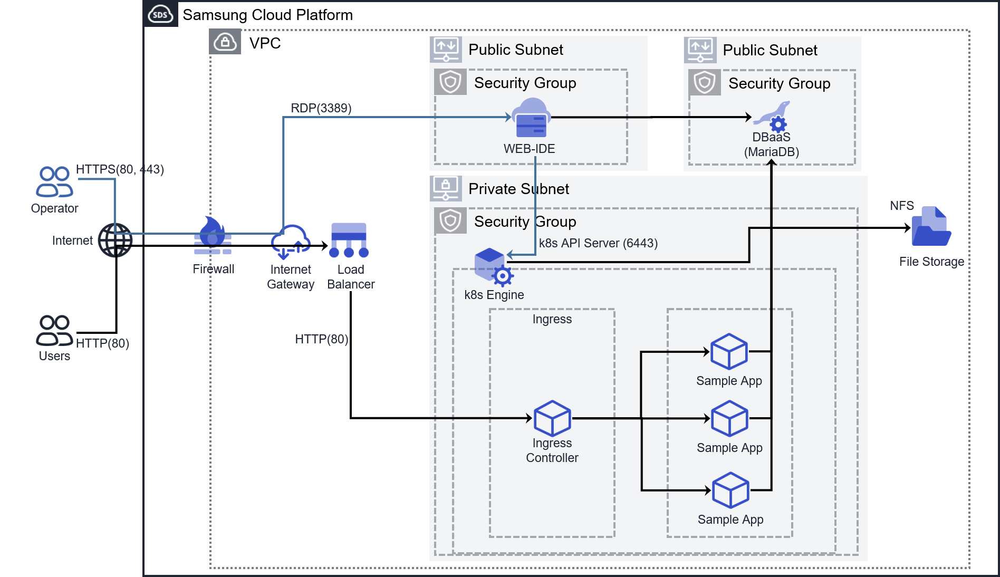


### 1.2.2 관련 용어
| No. | 용어 | 설명 |
| :-- | :--- | :--- |
| 1 | VPC (Virtual Private Cloud) | 사용자가 정의하는 가상의 네트워크로, 클라우드 상에 논리적으로 격리된 공간을 할당하여 SCP 리소스를 이용할 수 있는 서비스입니다. 사용 목적에 따라 여러 개를 생성하여 독립적으로 운영할 수 있습니다. |
| 2 | 서브넷 (Subnet) | VPC의 IP 주소 범위를 사용 용도에 맞게 세분화한 네트워크 공간입니다. 목적에 따라 인터넷 통신이 가능한 Public Subnet, 내부 통신용 Private Subnet, 서버 간 직접 통신만 허용하는 Local Subnet 등으로 나누어 사용합니다. |
| 3 | Local Subnet | 다른 서브넷이나 외부와 통신하지 않고, 동일 서브넷 내의 서버 간 통신만 허용하는 서브넷입니다. 고성능 컴퓨팅(HPC) 등 서버 간 통신이 중요할 때 사용됩니다. |
| 4 | Internet Gateway | VPC가 외부 인터넷과 통신이 가능하도록 제공하는 업링크 인터넷 연결 지점입니다. |
| 5 | NAT Gateway | Private Subnet의 서버가 외부 인터넷에 Outbound 통신을 할 수 있도록 대표 공인 IP로 변환해주는 게이트웨이입니다. |
| 6 | Firewall (VPC 방화벽) | VPC의 경계에서 인바운드/아웃바운드 트래픽을 제어하는 가상의 논리적 방화벽입니다. VPC 외부와 내부 사이의 트래픽을 제어하며, 서브넷/VM 간의 통신은 제어하지 않습니다. |
| 7 | Security Group | Virtual Server의 네트워크 인터페이스(vNIC)에 적용되는 가상 방화벽입니다. 서버에 도달하고 나가는 Inbound/Outbound 트래픽을 제어하며, VPC 내부(East-West)와 외부(North-South) 통신을 모두 제어할 수 있습니다. |
| 8 | Public IP (공인 IP) | 인터넷을 통해 전 세계 어디에서나 접근할 수 있는 고유한 IP 주소입니다. 외부 서비스 제공, 원격 접속 등에 사용됩니다. |

### 1.3 따라하기

### 1.3.1 VPC 상품 신청하기

#### 1. **경로:** 서비스 → Networking → VPC → VPC
#### 2. **입력 정보:**
- **VPC 명:** `vpc-hol2` (영문, 숫자, 하이픈(-) 포함 3~20자)
- **IP 대역:** `192.168.0.0/16` (/16 ~ /24 사이의 대역 선택)

### 1.3.2 Internet Gateway 연결하기

#### 1. **경로:** 서비스 → Networking → VPC → Internet Gateway
#### 2. **입력 정보:**
- **VPC 명:** `vpc-hol2`
- **구분:** `Internet Gateway`
- **Firewall 사용:** `Yes`
- **Firewall 로그 저장 여부:** `No`
- **참고:** Internet Gateway 이름은 `IGW_{VPC명}`으로 자동 생성됩니다.

### 3.3.3 Subnet 추가하기

#### 1. **경로:** 서비스 → Networking → VPC → Subnet
#### 2. **입력 정보:**
- **Bastion Host용 서브넷 (Public)**
    - **Subnet 유형:** `General`
    - **VPC 명:** `vpc-hol2`
    - **Subnet명:** `PublicSUB`
    - **IP 대역:** `192.168.0.0/24` (/16 ~ /28 사이의 대역 선택)

- **Web Service용 서브넷 (Private)**
    - **Subnet 유형:** `General`
    - **VPC 명:** `vpc-hol2`
    - **Subnet명:** `PrivateK8S`
    - **IP 대역:** `192.168.10.0/24`

- **Database용 서브넷 (Private)**
    - **Subnet 유형:** `General`
    - **VPC 명:** `vpc-hol2`
    - **Subnet명:** `PrivateDB`
    - **IP 대역:** `192.168.20.0/24`

### 1.3.4 Firewall 생성 및 규칙 추가하기
Firewall은 기본적으로 모든 트래픽을 차단(Deny All)하므로, 필요한 통신을 허용하는 규칙을 명시적으로 추가해야 합니다.

#### 1. **경로:** 서비스 → Networking → Firewall → Firewall
#### 2. **입력 정보:**
- web-ide접속 규칙
    - 출발지 IP: `0.0.0.0/0`
    - 목적지 IP: `192.168.0.0/24`
    - 유형 : `TCP`
    - TCP 목적지 포트: `80, 443`
    - 방향: `inbound`
    - **용도:** `80`포트는 HTTP 웹 트래픽을 위한 기본 포트로, `443`포트는 HTTPS 보안 웹 트래픽을 위한 포트입니다. Web-IDE(code-server)에 안전하게 접속하기 위해 필요합니다. Let's Encrypt 인증서 발급 과정에서도 이 포트들이 사용됩니다.

- outbound 외부 인터넷 규칙
    - 출발지 IP: `192.168.0.0/24,192.168.10.0/24`
    - 목적지 IP: `0.0.0.0/0`
    - 유형 : `TCP`
    - TCP 목적지 포트: `80,443` 
    - 방향: `outbound`
    - **용도:** `80`과 `443`포트는 VM에서 외부 인터넷 리소스(패키지 다운로드, 외부 API 호출 등)에 접근하기 위해 필요합니다. 

- Sample Web Application 테스트 포트
    - 출발지 IP: `my public ip`
    - 목적지 IP: `192.168.0.0/24`
    - 유형 : `TCP`
    - TCP 목적지 포트: `3000`
    - 방향: `inbound`
    - **용도:** `3000`포트는 실습에서 개발하는 샘플 웹 애플리케이션의 기본 접속 포트입니다. 이 포트를 통해 개발한 애플리케이션을 외부에서 테스트할 수 있습니다.

| 규칙 이름 | 방향 | 출발지 IP | 목적지 IP | 유형 (포트) | 용도 |
| :--- | :--- | :--- | :--- | :--- | :--- |
| Web-IDE 접속 (HTTP/S) | `inbound` | `0.0.0.0/0` | `192.168.0.0/24` | `TCP` (80, 443) | Web-IDE 접속 및 Let's Encrypt 인증서 발급 |
| Outbound 인터넷 | `outbound` | `192.168.0.0/24,192.168.10.0/24` | `0.0.0.0/0` | `TCP` (80, 443) | 외부 인터넷 |
| 샘플 앱 테스트 | `inbound` | `my public ip` | `192.168.0.0/24` | `TCP` (3000) | 샘플 웹 애플리케이션 테스트 |

### 1.3.5 Security Group 생성 및 규칙 추가하기
Security Group 역시 기본적으로 모든 트래픽을 차단하며, 동일 서브넷 내의 통신도 허용 규칙이 없으면 차단됩니다.

#### 1. **경로:** 서비스 → Networking → Security Group → Security Group
#### 2. **Security Group 생성:**
- WEB-IDE용 Security Group
    - Security Group명: `BastionSG`
    - 로깅 여부 : `체크 해제`(사용 안함)
- 로드밸런서용 Security Group
    - Security Group명: `LBSG`
    - 로깅 여부 : `체크 해제`(사용 안함)
- 웹서비스용 Security Group
    - Security Group명: `WebServerSG`
    - 로깅 여부 : `체크 해제`(사용 안함)

#### 3. **규칙 추가:**
**`BastionSG` 규칙 (WEB-IDE 접속용):**
- WEB-IDE 접속 규칙(http)
  - 방향: `inbound`
  - 유형: `HTTP` (80) 선택
  - 대상주소: `0.0.0.0/0`
  - **용도:** WEB-IDE(code-server)에 HTTP 프로토콜로 접속하기 위한 규칙입니다. 초기 접속 및 Let's Encrypt 인증서 발급 과정에서 필요합니다.

- WEB-IDE 접속 규칙(https)
  - 방향: `inbound`
  - 유형: `HTTPS` (443) 선택
  - 대상주소: `0.0.0.0/0`
  - **용도:** WEB-IDE(code-server)에 HTTPS 프로토콜로 안전하게 접속하기 위한 규칙입니다. 인증서 발급 후 보안 접속에 사용됩니다.

- outbound 인터넷 접속 규칙(http)
  - 방향: `outbound`
  - 유형: `HTTP` (80) 선택
  - 대상주소: `0.0.0.0/0`
  - **용도:** VM에서 외부 HTTP 리소스(패키지 저장소, 웹 서비스 등)에 접근하기 위한 규칙입니다.

- outbound 인터넷 접속 규칙(https)
  - 방향: `outbound`
  - 유형: `HTTPS` (443) 선택
  - 대상주소: `0.0.0.0/0`
  - **용도:** VM에서 외부 HTTP 리소스(패키지 저장소, 웹 서비스 등)에 접근하기 위한 규칙입니다.

- outbound 인터넷 접속 규칙(k8s)
  - 방향: `outbound`
  - 허용 포트: `사용자 지정 TCP`
  - 포트 범위: `6443` (6443은 K8s API 서버 통신용)
  - 대상주소: `192.168.10.0/24`
  - **용도:** VM에서 외부 Kubernetes API에 안전하게 접근하기 위한 규칙입니다.
  
- Sample Web Application 테스트 포트
  - 방향: `inbound`
  - 허용 포트: `사용자 지정 TCP`
  - 포트 범위: `3000`
  - 대상주소 : `<my public ip>`
  - **용도:** 실습에서 개발하는 샘플 웹 애플리케이션에 접근하기 위한 포트입니다. 개발 중인 애플리케이션을 외부에서 테스트할 때 사용됩니다.


| 규칙 이름 | 방향 | 유형 (허용 포트) | 대상 주소 | 용도 |
| :--- | :--- | :--- | :--- | :--- |
| WEB-IDE 접속 규칙 (http) | `inbound` | `HTTP` (80) | `0.0.0.0/0` | WEB-IDE 초기 접속 및 Let's Encrypt 인증서 발급 |
| WEB-IDE 접속 규칙 (https) | `inbound` | `HTTPS` (443) | `0.0.0.0/0` | WEB-IDE 보안 접속 |
| outbound 인터넷 접속 규칙 (http) | `outbound` | `HTTP` (80) | `0.0.0.0/0` | VM에서 외부 HTTP 리소스 접근 |
| outbound 인터넷 접속 규칙 (https) | `outbound` | `HTTPS` (443) | `0.0.0.0/0` | VM에서 외부 HTTPS 리소스 접근 |
| outbound 인터넷 접속 규칙 (k8s) | `outbound` | `사용자 지정 TCP` (6443) | `0.0.0.0/0` | VM에서 외부 Kubernetes API 접근 |
| Sample Web App 테스트 포트 | `inbound` | `사용자 지정 TCP` (3000) | `<my public ip>` | 샘플 웹 애플리케이션 테스트 접속 |


**`LBSG` 규칙 (LB용):**
- LB 접속 규칙(http)
  - 방향: `inbound`
  - 유형: `HTTP` (80) 선택
  - 대상주소: `0.0.0.0/0`
  - **용도:** LB에 HTTP 프로토콜로 접속하기 위한 규칙입니다.

<!-- - LB 접속 규칙(https)
  - 방향: `inbound`
  - 유형: `HTTPS` (443) 선택
  - 대상주소: `0.0.0.0/0`
  - **용도:** LB에 HTTPS 프로토콜로 안전하게 접속하기 위한 규칙입니다. -->

| 규칙 이름 | 방향 | 유형 (허용 포트) | 대상 주소 | 용도 |
| :--- | :--- | :--- | :--- | :--- |
| LB 접속 규칙 (http) | `inbound` | `HTTP` (80) | `0.0.0.0/0` | LB 접속용 |
| LB 접속 규칙 (https) | `inbound` | `HTTPS` (443) | `0.0.0.0/0` | LB 접속용 |


### 3.4 정리하기
이번 실습을 통해 Samsung Cloud Platform에서 가장 기본적인 네트워크 환경을 구축하는 방법을 학습했습니다. 논리적으로 격리된 VPC를 생성하고, 그 안에 Public Subnet과 Private Subnet을 구성하여 네트워크를 용도에 맞게 분리했습니다.

또한, Internet Gateway를 VPC에 연결하여 외부 인터넷과의 통신 경로를 확보했으며, VPC Firewall과 Security Group에 필요한 규칙을 설정하여 허용된 트래픽만 VPC와 서버에 도달하도록 제어했습니다.

이를 통해 안전하고 확장 가능한 클라우드 인프라의 기초를 마련했으며, 앞으로 생성될 다양한 서비스들이 동작할 수 있는 네트워크 기반을 성공적으로 구축했습니다.


<!-- ## 4. 부하분산을 위한 Load Balancer 생성 준비

### 4.1 학습목표
- Load Balancer의 필요성과 역할을 이해하고, 트래픽을 여러 서버에 분산시키는 원리를 학습합니다.
- SCP 콘솔을 사용하여 L7 Load Balancer를 생성하고 기본 설정을 구성할 수 있습니다.
- Listener를 설정하여 특정 포트의 트래픽을 수신하고, 이를 처리할 서버 그룹을 연결하는 방법을 익힙니다.
- 서버의 상태를 주기적으로 확인하는 Health Check를 구성하여 서비스 안정성을 높일 수 있습니다.
- Load Balancer와 서버 간의 원활한 통신을 위해 Security Group 및 Firewall 규칙을 올바르게 설정할 수 있습니다.

### 4.2 들어가기
웹 서비스의 사용자가 증가하면 한 대의 서버만으로는 모든 요청을 안정적으로 처리하기 어렵습니다. 트래픽이 몰리면 서버에 과부하가 걸려 응답이 느려지거나 서비스가 중단될 수 있습니다. Load Balancer는 이러한 문제를 해결하기 위해 들어오는 트래픽을 여러 대의 서버(서버 그룹)에 자동으로 분산시켜주는 서비스입니다.

Load Balancer를 사용하면 다음과 같은 이점을 얻을 수 있습니다.
- **부하 분산(Load Balancing):** 여러 서버에 트래픽을 고르게 분배하여 특정 서버의 과부하를 방지합니다.
- **고가용성(High Availability):** 일부 서버에 장애가 발생하더라도, Health Check를 통해 정상적으로 동작하는 다른 서버로만 트래픽을 자동 전송하여 서비스 중단을 방지합니다.
- **확장성(Scalability):** 트래픽 양에 따라 서버 수를 유연하게 늘리거나 줄일 수 있어(Scale-out/in), 비용 효율적인 인프라 운영이 가능합니다.

본 실습에서는 여러 웹 서버 앞단에 Load Balancer를 배치하여 안정적이고 확장 가능한 서비스 아키텍처를 구축하는 과정을 학습합니다.

### 4.2.1 서비스 개념도
외부 인터넷을 통해 들어온 사용자 요청 트래픽은 가장 먼저 Load Balancer의 공인 IP(Service IP)에 도달합니다. Load Balancer의 Listener는 지정된 포트(예: 80)에서 이 요청을 수신한 후, 연결된 서버 그룹 내에서 Health Check를 통과한 건강한(Healthy) 상태의 웹 서버 중 하나에게 트래픽을 전달합니다. 이 과정을 통해 단일 서버에 집중될 수 있는 부하가 여러 서버로 분산되어 안정적인 서비스가 가능해집니다.

### 4.2.2 관련 용어
| No. | 용어 | 설명 |
| :-- | :--- | :--- |
| 1 | Load Balancer | 클라이언트의 요청을 여러 서버에 분산하여 전달하는 네트워크 장비 또는 서비스입니다. L4(Transport 계층), L7(Application 계층) 등 다양한 유형이 있습니다. |
| 2 | Listener | Load Balancer가 특정 프로토콜과 포트로 들어오는 클라이언트의 연결 요청을 수신하는 프로세스입니다. Listener 규칙에 따라 요청을 처리할 서버 그룹을 결정합니다. |
| 3 | LB 서버 그룹 (Server Group) | Load Balancer로부터 트래픽을 전달받을 대상 서버들의 논리적인 모음입니다. Auto Scaling Group과 연동하여 서버를 동적으로 추가/제거할 수 있습니다. |
| 4 | 헬스 체크 (Health Check) | 서버 그룹에 속한 서버들이 정상적으로 서비스를 제공할 수 있는 상태인지 주기적으로 검사하는 기능입니다. 비정상(Unhealthy)으로 판별된 서버는 트래픽 분산 대상에서 일시적으로 제외됩니다. |
| 5 | Service IP | Load Balancer가 클라이언트로부터 트래픽을 수신하는 대표 공인 IP 주소입니다. 사용자는 이 IP를 통해 서비스에 접근합니다. |
| 6 | Source NAT IP | Load Balancer가 서버 그룹의 내부 서버들과 통신할 때 사용하는 출발지 IP 주소입니다. Private Subnet에 있는 서버들은 이 IP를 통해 들어오는 요청을 허용해야 합니다. |
| 7 | Round Robin | 서버 그룹의 서버들에게 순서대로 돌아가며 요청을 균등하게 분배하는 가장 기본적인 방식입니다. |
| 8 | Least Connection | 현재 연결 수가 가장 적은 서버에게 다음 요청을 보내는 방식입니다. 서버별로 처리 능력이 다르거나 요청 처리 시간이 길어질 때 유용합니다. |
| 9 | IP Hash | 클라이언트의 IP 주소를 해싱(Hashing)하여 특정 서버로만 요청을 보내는 방식입니다. 한 클라이언트는 항상 같은 서버에 연결되므로 세션 유지가 필요할 때 사용됩니다. |

### 4.3 따라하기

### 4.3.1 Load Balancer 상품 신청하기

#### 1. **경로:** 서비스 → Networking → Load Balancer → Load Balancer 생성
#### 2. **입력정보:**
- **Load Balancer 명:** `lb-hol2`
- **서비스 구분:** `L7`
- **VPC:** `VPC`
- **Service Subnet:** `PublicSUB`
- **Public NAT IP:** `사용 및 신규 생성`
- **Firewall 사용:** `사용 안함`
- **Firewall 로그 저장 여부:** `사용 안함`

### 4.3.2 LB Listener 생성하기

#### 1. **경로:** 서비스 → Networking → Load Balancer → Load Balancer 상세 → 연결된 자원 탭 → Listener 생성
#### 2. **입력정보:**
- **Listener 명:** `lb-listener`
- **프로토콜:** `HTTP`
- **서비스 포트:** `80`
- **LB 서버 그룹:** (미지정)

### 4.3.3 LB 헬스 체크 생성하기

#### 1. **경로:** 서비스 → Networking → Load Balancer → LB 헬스 체크 → LB 헬스 체크 생성
#### 2. **입력정보:**
- **LB 헬스 체크명:** `lb-hc-hol2`
- **VPC:** `vpc-hol2`
- **Service Subnet:** `PublicSUB`
- **프로토콜:** `TCP`
- **헬스 체크 포트:** `80`

### 4.3.4 Load Balancer Security Group에 등록하기

#### 1. **경로:** 서비스 → Networking → Security Group → Security Group
#### 2. **입력정보:**
- **Security Group 명:** `WebServerSG`
- **방향:** `Inbound 규칙`
- **유형:** `사용자 지정 TCP`
- **포트 범위:** `80`
- **대상 주소:** `192.168.0.0/24`

### 4.3.5 Load Balancer Firewall에 등록하기

#### 1. **경로:** 서비스 → Networking → Firewall → Firewall
#### 2. **입력정보:**
- **Firewall 명:** `FW_IGW_vpc-hol2`
- **출발지 주소:** `0.0.0.0/0`
- **목적지 주소:** `192.168.0.0/24`
- **프로토콜:** `TCP`
- **목적지 포트:** `80`
- **동작:** `Allow`
- **방향:** `Inbound`

### 4.4 정리하기
이번 실습을 통해 서비스의 안정성과 확장성을 확보하기 위한 핵심 요소인 Load Balancer를 성공적으로 구축했습니다. 먼저 Load Balancer 리소스를 생성하고, HTTP:80 포트로 들어오는 트래픽을 수신할 Listener를 설정했습니다. 또한, 서버의 상태를 지속적으로 모니터링하기 위한 Health Check를 구성하여 비정상적인 서버로는 트래픽이 전달되지 않도록 설정했습니다.

마지막으로, 외부 사용자의 요청이 Load Balancer를 통해 내부 웹 서버까지 안전하게 도달할 수 있도록 Firewall과 Security Group의 Inbound 규칙을 올바르게 수정했습니다. 이로써 여러 대의 서버가 트래픽을 효율적으로 나누어 처리하는 부하 분산 환경의 기반을 마련했습니다. -->

## 4. File Storage 생성

### 4.1 학습목표
- File Storage의 개념과 NFS 프로토콜의 역할을 이해합니다.
- 여러 서버가 네트워크를 통해 공유할 수 있는 파일 시스템을 생성하고 구성할 수 있습니다.
- 생성된 File Storage를 Virtual Server에 마운트하여 실제 파일 시스템처럼 사용하는 방법을 학습합니다.
- Security Group 규칙을 설정하여 File Storage에 대한 네트워크 접근을 제어할 수 있습니다.

### 4.2 들어가기
File Storage는 여러 Virtual Server가 네트워크를 통해 동시에 접근하여 데이터를 공유할 수 있도록 설계된 완전 관리형 공유 스토리지 서비스입니다. NFS(Network File System) 프로토콜을 기반으로 동작하며, 사용자는 복잡한 파일 서버를 직접 구축하고 관리할 필요 없이 간편하게 공유 파일 시스템을 이용할 수 있습니다.

Auto-Scaling 환경에서 여러 웹 서버가 동일한 웹 콘텐츠나 데이터를 공유해야 할 때, 또는 여러 개발 서버가 공통된 개발 소스나 라이브러리를 사용해야 할 경우에 매우 유용합니다. 데이터는 자동으로 복제되어 안전하게 보관되며, 사용량에 따라 용량이 자동으로 확장되어 스토리지 관리에 대한 부담을 덜어줍니다.

본 실습에서는 여러 웹 서버가 공통으로 사용할 데이터를 저장하기 위한 File Storage를 생성하고, 이를 `web-ide` 서버에 연결하여 사용하는 방법을 학습합니다.

### 4.2.1 서비스 개념도
File Storage는 VPC 내의 특정 서브넷에 '마운트 타겟(Mount Target)'이라는 네트워크 인터페이스를 생성합니다. 이 마운트 타겟은 Private IP를 가지며, 동일한 VPC 내의 서버들은 이 IP 주소를 통해 NFS 프로토콜로 File Storage에 접근하여 자신의 로컬 디스크처럼 마운트할 수 있습니다. 여러 서버가 동일한 마운트 타겟을 통해 같은 파일 시스템에 데이터를 읽고 쓸 수 있는 공유 구조입니다.

- **Virtual Servers (in Public/Private Subnets)** → (NFS Port 2049) → **Mount Target (Private IP in a Subnet)** ↔ **File Storage Volume**

### 4.2.2 관련 개념 및 용어
| No. | 용어 | 설명 |
| :-- | :--- | :--- |
| 1 | **File Storage** | NFS 프로토콜을 기반으로 여러 서버에 공유 파일 시스템을 제공하는 완전 관리형 스토리지 서비스입니다. |
| 2 | **NFS (Network File System)** | 원격 컴퓨터에 있는 파일을 네트워크를 통해 로컬 파일처럼 접근하고 사용할 수 있게 해주는 분산 파일 시스템 프로토콜입니다. |
| 3 | **볼륨 (Volume)** | 데이터가 실제로 저장되는 파일 시스템 단위입니다. 사용자는 필요에 따라 여러 볼륨을 생성할 수 있습니다. |
| 4 | **마운트 타겟 (Mount Target)** | File Storage 볼륨에 접근할 수 있도록 VPC 내 서브넷에 생성되는 네트워크 인터페이스입니다. 고유한 Private IP를 가지며, 서버들은 이 IP를 통해 볼륨에 연결합니다. |
| 5 | **마운트 (Mount)** | 원격 파일 시스템(File Storage)을 로컬 서버의 특정 디렉터리에 연결하여 사용할 수 있도록 만드는 과정입니다. |
| 6 | **스냅샷 (Snapshot)** | 특정 시점의 볼륨 데이터를 그대로 복사하여 저장하는 기능입니다. 데이터 백업 및 복원 용도로 사용됩니다. |

### 4.3 따라하기

### 4.3.1 File Storage 상품 신청하기

1.  **경로:** 서비스 → Storage → File Storage → File Storage
2.  **입력 정보:**
    -   **볼륨명:** `fs_hol2`
    -   **프로토콜:** `NFS`

<!-- ### 4.3.2 Mount Target 생성하기
File Storage를 서버에 연결하려면 먼저 VPC 내에 네트워크 연결 지점인 Mount Target을 생성해야 합니다.

1.  **경로:** 서비스 → Storage → File Storage → Mount Target → `[Mount Target 생성]`
2.  **입력 정보:**
    -   **Mount Target 명:** `fs-hol2-mt`
    -   **VPC:** `vpc-hol2`
    -   **Subnet:** `PrivateK8S` (웹 서버들이 접근할 서브넷)
    -   **IP 할당 방식:** `자동 할당`
    -   **Security Group:** `WebServerSG` (웹 서버용 보안 그룹)

### 4.3.3 Security Group 규칙 추가하기
`web-ide` 서버와 `WebServerSG`에 속한 서버들이 File Storage에 접근할 수 있도록 NFS 트래픽을 허용하는 규칙을 추가해야 합니다.

1.  **경로:** 서비스 → Networking → Security Group → Security Group
2.  **`BastionSG` 규칙 추가 (`web-ide` → File Storage 접근 허용):**
    -   **Security Group 선택:** `BastionSG`
    -   **규칙 추가:**
        -   **방향:** `Outbound 규칙`
        -   **유형:** `NFS` (2049) 선택
        -   **대상 주소:** `192.168.10.0/24` (PrivateK8S Subnet 대역)
        -   **용도:** Web-IDE에서 PrivateK8S Subnet에 있는 Mount Target으로 NFS 접속을 허용합니다.

3.  **`WebServerSG` 규칙 추가 (웹 서버들 ↔ File Storage 접근 허용):**
    -   **Security Group 선택:** `WebServerSG`
    -   **규칙 추가:**
        -   **방향:** `Inbound 규칙`
        -   **유형:** `NFS` (2049) 선택
        -   **대상 주소:** `192.168.0.0/24, 192.168.10.0/24` (Bastion 및 WebServer에서 NFS 접근 허용)
        -   **용도:** Bastion Host와 다른 웹 서버들이 Mount Target으로 NFS 접속을 허용합니다.

### 4.3.4 Web-IDE에서 File Storage 마운트하기
이제 `web-ide` 서버에서 생성한 File Storage를 마운트하여 실제로 사용해 봅니다.

1.  **Mount Target IP 및 마운트 경로 확인:**
    -   **경로:** 서비스 → Storage → File Storage → Mount Target
    -   생성한 `fs-hol2-mt`를 선택하고 상세 정보에서 **Mount Target IP**와 **Mount 경로**를 확인하고 복사합니다. (예: `192.168.10.x`, `/fs-hol2`)

2.  **Web-IDE 터미널에서 마운트 실행:**
    -   Web-IDE 터미널을 엽니다.
    -   마운트할 디렉터리를 생성합니다.
        ```bash
        sudo mkdir -p /mnt/shared-storage
        ```
    -   `mount` 명령어를 사용하여 File Storage를 방금 만든 디렉터리에 마운트합니다. **아래 명령어의 `<Mount-Target-IP>`와 `</fs-hol2>` 부분은 1단계에서 확인한 정보로 변경해야 합니다.**
        ```bash
        # sudo mount -t nfs <Mount-Target-IP>:<Mount-경로> <마운트-디렉터리>
        sudo mount -t nfs 192.168.10.x:/fs-hol2 /mnt/shared-storage
        ```
    -   **참고:** 만약 `mount.nfs: Connection timed out` 오류가 발생하면 Security Group 규칙이 올바르게 설정되었는지 다시 확인하세요.

3.  **마운트 확인 및 테스트 파일 생성:**
    -   `df -h` 명령어로 마운트가 잘 되었는지 확인합니다. 목록에 NFS 마운트 정보가 보여야 합니다.
        ```bash
        df -h
        ```
    -   마운트된 디렉터리로 이동하여 테스트 파일을 생성해 봅니다.
        ```bash
        cd /mnt/shared-storage
        sudo touch test_from_webide.txt
        ls -l
        ```
        `test_from_webide.txt` 파일이 보이면 성공입니다. 이 파일은 File Storage에 저장되었으므로, 동일한 스토리지를 마운트하는 다른 모든 서버에서도 이 파일을 볼 수 있습니다. -->

### 4.4 정리하기
이번 장에서는 여러 서버가 데이터를 공유할 수 있는 완전 관리형 서비스인 **File Storage**를 생성하는 방법을 학습했습니다. 

<!-- 또한, `web-ide`와 웹 서버들이 File Storage에 안전하게 접근할 수 있도록 **Security Group**에 NFS(Port 2049) 트래픽을 허용하는 Inbound/Outbound 규칙을 추가했습니다. 마지막으로, `web-ide` 서버에서 `mount` 명령어를 사용하여 원격 File Storage를 로컬 디렉터리처럼 연결하고 파일을 생성하여, 공유 스토리지로서의 기능을 직접 확인했습니다.

이를 통해 향후 Auto-Scaling으로 생성될 여러 웹 서버들이 동일한 데이터를 일관되게 서비스할 수 있는 기반을 마련했습니다. -->


## 5. DB Service 생성

### 5.1 학습목표
- MariaDB(DBaaS)의 개념과 완전 관리형 서비스의 이점을 이해합니다.
- SCP 콘솔을 통해 신규 MariaDB 인스턴스를 생성하고 기본 설정을 구성할 수 있습니다.
- 보안을 위해 Private Subnet에 데이터베이스를 배치하고 Bastion Host를 통해 접속하는 아키텍처의 개념을 이해합니다.

### 5.2 들어가기
Samsung Cloud Platform(SCP)은 다양한 워크로드와 요구사항에 맞춰 여러 종류의 데이터베이스 서비스를 제공합니다. 관계형 데이터베이스(RDB)로는 **MariaDB, MySQL, PostgreSQL, Microsoft SQL Server, EPAS** 등을 완전 관리형(DBaaS)으로 제공하며, **Tibero, Vertica, CUBRID**와 같은 상용 및 특화 RDB도 지원합니다. 또한, 빠른 데이터 처리가 필요할 때 사용하는 In-memory DB인 **Redis(CacheStore)**와 분산형 NoSQL DB인 **Cassandra**도 제공하여 유연한 데이터 아키텍처 구성이 가능합니다.

이 실습에서는 그중 가장 널리 사용되는 오픈 소스 관계형 데이터베이스 중 하나인 **MariaDB(DBaaS)**를 생성하고 구성하는 방법을 학습합니다.

Samsung Cloud Platform에서 제공하는 MariaDB(DBaaS)는 MySQL과 호환성이 높은 오픈 소스 관계형 데이터베이스(RDBMS)를 완전 관리형 서비스로 제공합니다. 사용자는 웹 기반 콘솔을 통해 복잡한 설치 과정 없이 손쉽게 데이터베이스를 생성하고 운영할 수 있습니다. DBaaS를 사용하면 고가용성, 백업, 보안 등 복잡한 데이터베이스 관리를 SCP에 위임하고, 사용자는 애플리케이션 개발과 데이터 관리에만 집중할 수 있습니다.

### 5.2.1 서비스 개념도
DB Service는 보안을 위해 외부에서 직접 접근할 수 없는 Private Subnet에 배치하는 것이 가장 이상적입니다. 이 경우, Public Subnet에 위치한 Bastion Host를 통해 DB에 접근하는 아키텍처를 구성합니다. 사용자는 Bastion Host에 원격으로 접속한 뒤, 그 서버 내부에서 DB 클라이언트 도구를 사용하여 Private Subnet에 있는 MariaDB에 안전하게 접속합니다.

- **사용자** → (RDP/SSH) → **Bastion Host (Public Subnet)** → (DB Port) → **MariaDB (Private Subnet)**

또한, 서비스의 안정성을 위해 Active 서버와 Standby 서버로 구성된 이중화(Active-Standby)를 통해 장애 발생 시 자동으로 Failover가 이루어져 서비스 중단을 최소화합니다.

### 5.2.2 관련 개념 및 용어
| No. | 용어 | 설명 |
| :-- | :--- | :--- |
| 1 | DBaaS (Database as a Service) | 클라우드 제공업체가 데이터베이스 설치, 운영, 관리(백업, 이중화, 모니터링 등)를 자동화하여 서비스 형태로 제공하는 모델입니다. |
| 2 | Active-Standby 이중화 | Active 서버(운영)와 Standby 서버(대기)를 구성하여, Active 서버 장애 시 Standby 서버로 자동 전환(Failover)되어 고가용성을 보장하는 구조입니다. |
| 3 | Read Replica (읽기 전용 복제본) | Master DB의 데이터를 실시간으로 복제하는 읽기 전용 데이터베이스입니다. 읽기 작업의 부하를 분산시키거나 재해 복구(DR) 용도로 사용됩니다. |
| 4 | Bastion Host | Private Subnet과 같이 외부에서 직접 접근할 수 없는 네트워크 영역의 자원(DB, 서버 등)에 접근하기 위한 통로 역할을 하는 보안 강화 서버입니다. |
| 5 | IP 접근 제어 | 특정 IP 주소나 대역에서만 DB에 접속할 수 있도록 허용/차단 규칙을 설정하는 보안 기능입니다. |
| 6 | PITR (Point-in-Time Recovery) | 데이터베이스를 특정 시점(날짜와 시간)으로 정확하게 복원하는 기능입니다. 트랜잭션 로그(Archive Log)를 사용하여 구현됩니다. |
| 7 | Audit Log | 데이터베이스에 대한 접근 및 DDL/DML 실행 기록을 추적하고 기록하는 기능으로, 보안 감사에 활용됩니다. |

### 5.3 따라하기

### 5.3.1 DB Service 상품 신청하기

#### 1. **경로:** 서비스 → Database → MariaDB(DBaaS) → MariaDB(DBaaS)
#### 2. **입력정보:**
- **Image 버전:** `MariaDB Community 10.11.9`
- **서버명 prefix:** `mdb`
- **클러스터명:** `mdbcls`
- **서버 타입:** `Standard(db1) | db1v1m2 (vCPU 1 | Memory 2G)`
- **DATA:** `16` GB
- **VPC:** `vpc-hol2`
- **Subnet:** `PrivateDB`
- **IP 접근 제어:** `192.168.0.0/24, 192.168.10.0/24`
- **Database 명:** `webdb`
- **Database 사용자명:** `dbuser`
- **Database 비밀번호:** `dbpassword1!`
- **Database 비밀번호 확인:** `dbpassword1!`
- **Database Port번호:** `2866`
- **백업:** `사용하지 않음`
- **Audit Log 설정:** `사용하지 않음`
- `기타 설정은 Default로 유지`

### 5.4 정리하기
이번 실습을 통해 완전 관리형 데이터베이스 서비스인 MariaDB(DBaaS)의 개념과 이점을 이해했습니다. SCP 콘솔을 사용하여 Private Subnet에 신규 MariaDB 인스턴스를 생성하고, 서버 타입, 스토리지, 네트워크, 초기 데이터베이스 정보 등 필수 항목을 직접 구성하는 방법을 익혔습니다. 또한, Bastion Host를 통해 안전하게 데이터베이스에 접속하는 권장 아키텍처를 학습했습니다. 이로써 애플리케이션의 데이터를 저장하고 관리할 안정적이고 보안성이 높은 데이터베이스 기반을 성공적으로 마련했습니다.


## 6. Bastion Host를 위한 Virtual Server 생성

### 6.1 학습목표
- Bastion Host의 개념과 보안적 역할을 이해합니다.
- SCP Virtual Server를 사용하여 Windows 가상 서버를 생성하고 설정할 수 있습니다.
- Public Subnet에 서버를 배치하고 Public NAT IP를 할당하여 외부 접속 환경을 구성할 수 있습니다.
- Keypair를 생성하고 관리하여 서버에 안전하게 접속하는 방법을 학습합니다.

### 6.2 들어가기
클라우드 환경에서 데이터베이스나 내부 애플리케이션 서버와 같이 민감한 자원은 보안을 위해 외부에서 직접 접근할 수 없는 Private Subnet에 배치하는 것이 일반적입니다. 하지만 운영 및 관리를 위해 이러한 내부 자원에 접근해야 할 필요가 있습니다. 이때 사용되는 것이 **Bastion Host**입니다.

Bastion Host는 '요새'라는 이름처럼, 외부 네트워크(인터넷)와 내부 Private 네트워크 사이의 게이트웨이 역할을 하는 보안 강화 서버입니다. 관리자는 인터넷을 통해 Public Subnet에 위치한 Bastion Host에 먼저 접속한 뒤, 이 서버를 경유하여 Private Subnet의 다른 서버나 DB에 안전하게 접근할 수 있습니다.

이 실습에서는 SCP의 핵심 컴퓨팅 서비스인 **Virtual Server**를 사용하여 Windows 운영체제의 Bastion Host를 생성하고, 관련 네트워크 설정을 구성하는 방법을 학습합니다. Virtual Server는 필요에 따라 CPU, 메모리 등의 자원을 유연하게 할당받아 사용하는 가상 서버로, 웹 콘솔을 통해 빠르고 편리하게 생성할 수 있습니다.

### 6.2.1 서비스 개념도
Bastion Host는 Public Subnet과 Private Subnet 사이의 다리 역할을 수행합니다. 관리자는 자신의 PC에서 인터넷을 통해 Bastion Host의 Public IP로 원격 접속(RDP)한 후, Bastion Host 내부에서 Private Subnet에 있는 다른 서버(예: 웹 서버, DB 서버)로 접근합니다.

- **관리자 PC (인터넷)** → (RDP, 포트 3389) → **Bastion Host (Public Subnet)** → (SSH/DB접속 등) → **내부 서버 (Private Subnet)**

이러한 구조를 통해 내부 서버들은 외부에 직접 노출되지 않으므로 보안이 강화되며, 모든 접근은 Bastion Host를 통해 중앙에서 관리 및 통제될 수 있습니다.

### 6.2.2 관련 용어
| No. | 용어 | 설명 |
| :-- | :--- | :--- |
| 1 | Virtual Server | 사용자가 CPU, 메모리, OS 등을 선택하여 클라우드 환경에 생성하는 가상 서버(IaaS)입니다. |
| 2 | Bastion Host | 외부에서 Private 네트워크 내의 자원에 안전하게 접근하기 위한 목적으로 사용되는 서버입니다. |
| 3 | Keypair | 서버에 암호 대신 공개 키 암호화 방식으로 안전하게 로그인하기 위해 사용하는 키 쌍(.pem 파일)입니다. |
| 4 | Public NAT IP | Virtual Server에 할당하여 인터넷에서 서버에 접근할 수 있도록 하는 공인 IP 주소입니다. |
| 5 | Security Group | Virtual Server에 적용되는 가상 방화벽으로, 서버로 들어오고 나가는 트래픽(Inbound/Outbound)을 제어합니다. |
| 6 | Init Script | Virtual Server가 처음 생성될 때 자동으로 실행되도록 지정하는 스크립트입니다. 초기 패키지 설치나 환경 설정에 사용됩니다. |

### 6.3 따라하기

### 6.3.1 WEB-IDE Virtual Server 생성

#### 1. 서비스 경로
- 서비스 → Compute → Virtual Server → `[Virtual Server 생성]`

#### 2. 입력 정보
- 이미지 선택: Custom : `ubuntu 24.04`
- 서비스 정보 입력
  - 서버 수: `1`
  - 상품 유형:
    - 서버타입: `Standard-1/s1v1m2(vCPU 1 | Memory 2G)`
  - Block Storage:
    - 기본 OS: `6` Units
  - 필수 정보 입력
    - 서버명 : `web-ide`
    - 네트워크 설정:
      - VPC: `vpc-hol2`
      - 일반 서브넷: `PublicSUB`
      - Public NAT: `사용 체크` → 신규 생성
      - Security Group: `BastionSG`
    - 서버 Key pair : `mykey-hol2` (신규 생성 후 **pem 키를 반드시 다운로드하여 보관**)
    - **Init script:** 아래 스크립트를 복사하여 붙여넣습니다. 이 스크립트는 web-ide를 설치하고 Virual Server 생성 시 동적으로 할당되는 Public IP를 설정 파일에 자동으로 업데이트합니다.

```bash
#!/bin/bash
set -e
REPO_URL="https://github.com/cwj3688/init-webide.git"
REPO_DIR="init-webide"
IMAGE_NAME="cwj3688/code-server-hol3"
HOME_DIR="/home/ubuntu"
PROJECT_DIR="${HOME_DIR}/project"
git clone "$REPO_URL"
cd "$REPO_DIR"
chmod +x install_docker.sh
./install_docker.sh
chmod +x update_ip.sh
./update_ip.sh
docker pull "$IMAGE_NAME"
mkdir -p "$PROJECT_DIR"
mkdir -p "${HOME_DIR}/.scp" "${HOME_DIR}/.scpconf" "${HOME_DIR}/.kube" "${HOME_DIR}/.config" "${HOME_DIR}/.local"
PASSWORD=$(openssl rand -base64 12)
echo "Your Web-IDE Password: ${PASSWORD}" > "${PROJECT_DIR}/env-info.txt"
DOCKER_GID=$(getent group docker | cut -d: -f3) PASSWORD=${PASSWORD} docker compose up -d
chown -R 1000:1000 "$HOME_DIR"
echo "================================================================"
echo "   A new password for the Web-IDE has been generated."
echo "   Password: ${PASSWORD}"
echo "   It has been saved to: ${PROJECT_DIR}/env-info.txt"
echo "================================================================"
echo "Web-IDE setup is complete!"
```

> **참고:** Virtual Server 생성 및 초기화 스크립트(code-server 구성)가 완료되기까지 **약 10~15분** 정도 소요될 수 있습니다.

### 6.3.2 web-ide 접속

#### 1. 접속 IP 정보 확인
- **생성된 VM의 Public IP 주소를 확인합니다.**
  - SCP 콘솔에 로그인합니다.
  - **경로**: 서비스 → Compute → Virtual Server → `[web-ide]`
  - 생성한 VM (web-ide)을 목록에서 찾아 선택합니다.
  - 상세 정보 화면에서 Public IP 주소를 복사해 둡니다.

#### 2. 패스워드 확인
- VM이 처음 생성될 때 초기화 스크립트(Init Script)가 실행되며, 이 과정에서 web-ide 접속을 위한 임시 비밀번호가 자동으로 생성됩니다. 이 비밀번호는 콘솔 로그에서 확인할 수 있습니다.
  - VM 상세 정보 화면에서 [콘솔 로그] 탭을 클릭합니다.
  - 로그 내용 중에서 아래와 같이 PASSWORD가 포함된 부분을 찾아 비밀번호를 확인하고 복사합니다. 

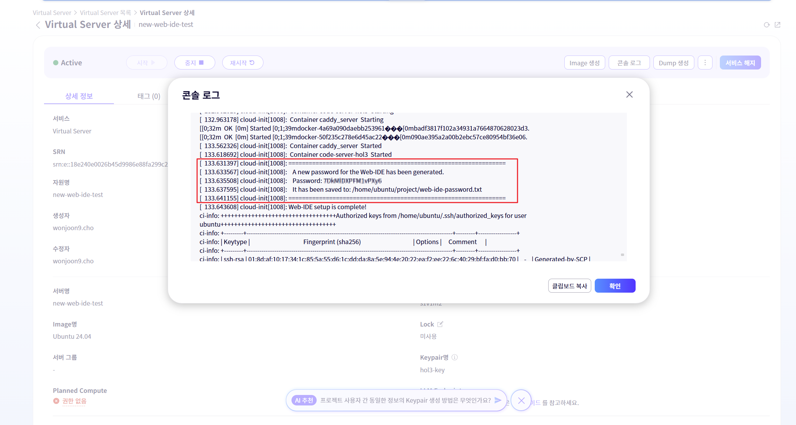

#### 3. web-ide 접속 및 로그인

- 이제 확인한 IP 주소와 비밀번호를 사용하여 웹 브라우저에서 web-ide에 접속합니다.
  - 웹 브라우저를 열고 주소창에 **https://<VM의-Public-IP>.sslip.io** 형식으로 입력합니다.
    (예시: `https://123.45.67.89.sslip.io`)
  - 로그인 화면이 나타나면, 2단계에서 확인한 비밀번호를 입력하여 접속합니다.

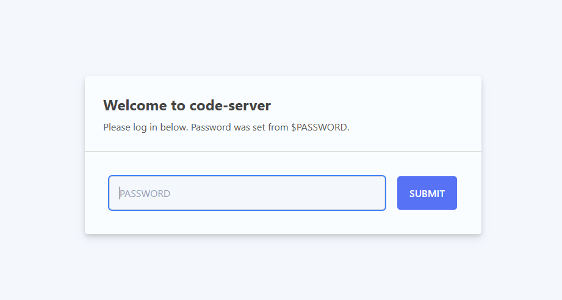


> **sslip.io 란?**
>
> `sslip.io`는 DNS 설정 없이 IP 주소를 기반으로 임시 도메인을 생성해주는 무료 와일드카드 DNS 서비스입니다.
> 예를 들어, VM의 Public IP가 `123.45.67.89` 이라면, 별도의 도메인 구매나 DNS 레코드 설정 없이 `https://123.45.67.89.sslip.io` 와 같은 주소로 즉시 접속할 수 있습니다.
> `sslip.io`는 주소에 포함된 IP 주소를 자동으로 인식하여 해당 IP로 연결해주는 원리로 동작합니다.
> 이번 실습에서는 이 서비스를 활용하여 우리가 배포하는 Gitea, Jenkins, ArgoCD 및 최종 애플리케이션에 쉽게 접근할 수 있는 도메인을 생성합니다.

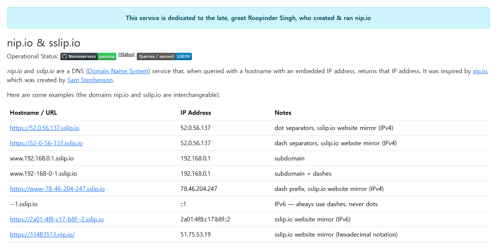


> **Let's Encrypt와 Caddy의 자동 HTTPS 동작 원리**
>
> `Let's Encrypt`는 웹사이트에 무료로 TLS 인증서를 발급해주는 비영리 인증 기관(CA)입니다. ([https://letsencrypt.org/](https://letsencrypt.org/)) 이를 통해 모든 웹 트래픽을 암호화(HTTPS)하여 보안을 강화할 수 있습니다.
>
> `Caddy`는 이 과정을 완전히 자동화하는 리버스 프록시 서버입니다. `Caddy`는 시작될 때 `sslip.io`와 같은 도메인 주소를 감지하고, 자동으로 Let's Encrypt에 해당 도메인에 대한 TLS 인증서를 요청합니다. Let's Encrypt는 ACME 프로토콜을 통해 해당 도메인의 소유권을 확인한 후(주로 80번 포트를 사용), 인증서를 발급합니다. Caddy는 발급받은 인증서를 즉시 적용하여 별도의 설정 없이 HTTPS를 활성화하고, 주기적으로 인증서를 자동 갱신까지 해줍니다.
> 이 실습 환경에서는 Caddy가 Web-IDE(code-server)로 들어오는 모든 요청을 받아 자동으로 HTTPS를 적용해주는 역할을 합니다.


#### 4. 작업 폴더의 파일들을 신뢰하고 모든 기능을 활성화
- 작업 폴더 신뢰하기: 보안 경고창이 나타나면, "Yes, I trust the authors" 버튼을 클릭하여 작업 폴더의 모든 파일을 신뢰하고 web-ide의 전체 기능을 활성화합니다.

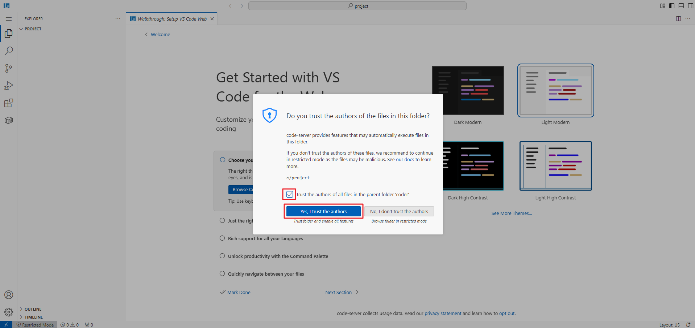

#### 5. 테마 설정(선택 사항)
- 원하는 에디터 테마를 선택합니다. 이 설정은 나중에 언제든지 변경할 수 있습니다.

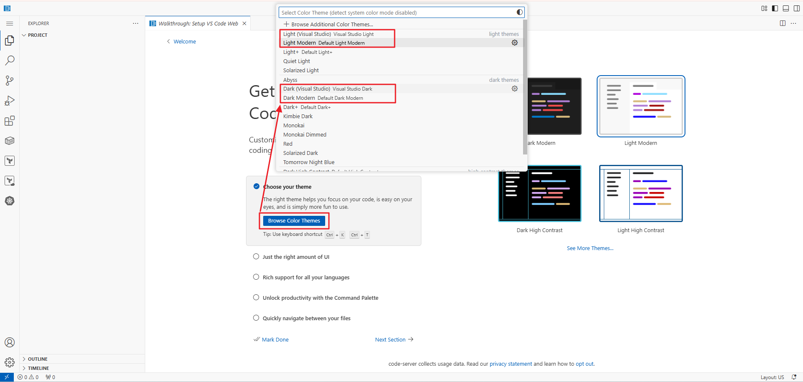


**이제부터 모든 터미널 작업은 이 `web-ide`의 웹 터미널에서 진행합니다.**

### 6.3.3 web-ide 구성 및 명령어 테스트

이 개발환경은 `code-server`를 기반으로 구성된 표준 클라우드 개발 환경에 대한 설명입니다. 운영자나 개발자들이 언제 어디서든 일관된 환경에서 효율적으로 작업할 수 있도록 다양한 도구와 확장이 사전 설치되어 있습니다.

#### 1. 기본 환경 (Base Environment)

본 개발 환경은 `code-server`의 특정 버전을 기반으로 구축되어, 웹 브라우저를 통해 Visual Studio Code의 강력한 기능을 그대로 사용할 수 있습니다.

- **`code-server` 버전:** `4.103.1`
- **기본 OS:** ubuntu 24.04
- **기본 셸:** `bash`

#### 2. 설치된 주요 도구 및 버전

클라우드 네이티브 애플리케이션 개발과 인프라 관리를 위해 다음과 같은 필수 도구들이 설치되어 있습니다.

| 도구 | 버전 | 설명 |
| --- | --- | --- |
| **Terraform** | 최신 안정 버전 | HashiCorp에서 개발한 IaC(Infrastructure as Code) 도구로, 인프라를 코드로 정의하고 프로비저닝합니다. |
| **Docker CLI** | 최신 안정 버전 | 컨테이너를 빌드하고 관리하기 위한 커맨드 라인 인터페이스입니다. (Docker Engine은 포함되지 않음) |
| **OpenJDK** | `17` | Java 애플리케이션 개발 및 실행을 위한 오픈소스 Java Development Kit입니다. |
| **Node.js** | `20.x` | JavaScript 런타임 환경으로, 백엔드 서비스 및 프론트엔드 개발에 사용됩니다. |
| **npm** | 최신 안정 버전 | Node.js 패키지 매니저입니다. |
| **Helm** | 최신 3.x 버전 | 쿠버네티스 패키지 매니저로, 애플리케이션 차트를 관리하고 배포합니다. |
| **Kubectl** | `1.31.8` | 쿠버네티스 클러스터를 제어하기 위한 커맨드 라인 도구입니다. |

#### 3. VS Code 확장 프로그램 (Extensions)

개발 생산성을 극대화하기 위해 다음과 같은 VS Code 확장 프로그램이 기본적으로 설치되어 있습니다.

- **`hashicorp.terraform`**: Terraform 코드의 구문 강조, 자동 완성, 포맷팅 및 유효성 검사 기능을 제공합니다.
- **`ms-azuretools.vscode-docker`**: Dockerfile 및 `docker-compose.yml` 파일 작성 지원, 컨테이너 및 이미지 관리 기능을 제공합니다.
- **`vscjava.vscode-java-pack`**: Java 개발을 위한 필수 확장 기능 모음으로, 코드 탐색, 디버깅, 테스트 등을 지원합니다.
- **`dbaeumer.vscode-eslint`**: JavaScript 및 TypeScript 코드의 정적 분석을 통해 잠재적인 오류와 코드 스타일 문제를 찾아줍니다.
- **`esbenp.prettier-vscode`**: 코드를 일관된 스타일로 자동 포맷팅해주는 포맷터입니다.
- **`ms-kubernetes-tools.vscode-kubernetes-tools`**: 쿠버네티스 매니페스트 파일 작성 지원, 클러스터 리소스 탐색 및 관리 기능을 제공합니다.
- **`redhat.vscode-yaml`**: YAML 파일의 유효성 검사, 구문 강조 및 자동 완성 기능을 제공하여 쿠버네티스 및 Helm 차트 작성을 돕습니다.

#### 4. 셸 환경 및 편의 기능

터미널 사용성을 높이기 위해 `bash` 셸에 다음과 같은 자동 완성 및 단축 명령어(alias)가 설정되어 있습니다.

**자동 완성 (Auto-completion)**

- `kubectl` 명령어 자동 완성이 활성화되어 리소스 이름, 명령어 등을 쉽게 입력할 수 있습니다.
- `helm` 명령어 자동 완성이 활성화되어 차트 및 릴리스 관리가 용이합니다.
- `terraform` 명령어 자동 완성이 활성화되어 있습니다.

**단축 명령어 (Alias)**

| 단축 명령어 | 원본 명령어 | 설명 |
| --- | --- | --- |
| `k` | `kubectl` | `kubectl` 명령어를 간결하게 사용합니다. |
| `h` | `helm` | `helm` 명령어를 간결하게 사용합니다. |
| `tf` | `terraform` | `terraform` 명령어를 간결하게 사용합니다. |
| `ll` | `ls -alF` | 파일의 상세 정보와 숨김 파일을 함께 표시합니다. |
| `la` | `ls -A` | `.`과 `..`을 제외한 모든 파일을 표시합니다. |
| `l` | `ls -CF` | 파일을 보기 쉽게 컬럼 형식으로 표시합니다. |
| `cls` | `clear` | 터미널 화면을 지웁니다. |

이처럼 잘 구성된 개발 환경을 통해 운영자/개발자는 복잡한 설정 과정 없이 즉시 프로젝트에 집중할 수 있습니다.

#### 5. 명령어 테스트 실습

- 터미널 열기
  - 메뉴 → Terminal → New Terminal

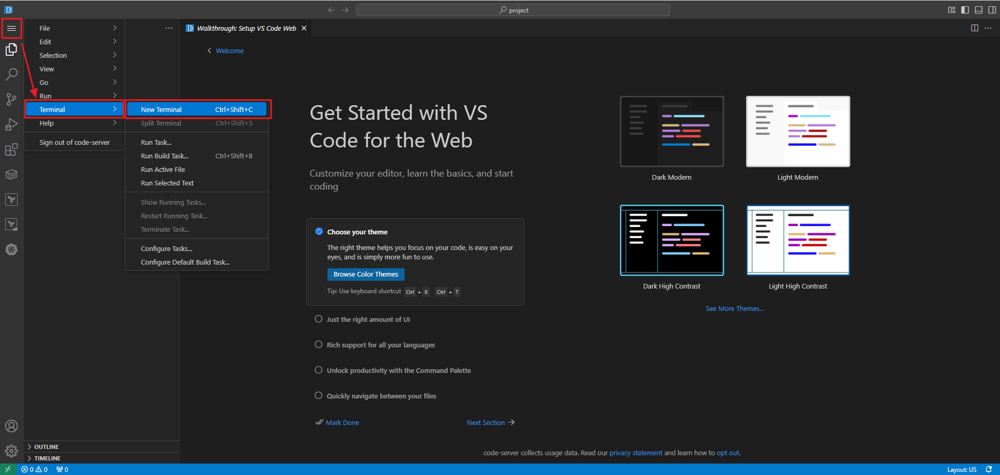


- git command
```bash
git version
```


- terraform command
```bash
terraform version
```


- docker command
```bash
docker --version
```


- java command
```bash
java --version
```


- nodejs command
```bash
nodejs --version
npm --version
```


- helm command
```bash
helm version
```


- kubectl comand
```bash
kubectl version
```


### 6.3.4 데이터베이스 접속 테스트

Private Subnet에 있는 데이터베이스에 접속하려면 먼저 `BastionSG` 보안 그룹에 아웃바운드 규칙을 추가하여 Web-IDE가 데이터베이스와 통신할 수 있도록 허용해야 합니다.

#### 1. 데이터베이스 접속을 위한 보안 그룹 규칙 추가

1.  **경로:** 서비스 → Networking → Security Group → Security Group
2.  **Security Group 선택:** `BastionSG`를 선택합니다.
3.  **규칙 추가:**
    -   **방향:** `Outbound 규칙`
    -   **유형:** `사용자 지정 TCP`
    -   **포트 범위:** `2866`
    -   **대상 주소:** `192.168.20.0/24` (PrivateDB Subnet의 IP 대역)
    -   **용도:** Web-IDE에서 Private Subnet에 있는 MariaDB 데이터베이스(Port 2866)로 접속을 허용합니다.

#### 2. Web-IDE에서 데이터베이스 클라이언트 설치

Web-IDE의 확장 프로그램 마켓플레이스에서 데이터베이스 클라이언트를 설치하여 GUI 환경에서 편리하게 데이터베이스에 접속하고 관리할 수 있습니다.

1.  Web-IDE 왼쪽의 **확장 프로그램(Extensions)** 아이콘을 클릭합니다.
2.  검색창에 `Database Client`를 입력하고 검색합니다.
3.  **Database Client** (cweijan.vscode-database-client)를 찾아 **Install** 버튼을 클릭합니다.

#### 3. 데이터베이스 접속 테스트

1.  **MariaDB Private IP 확인:**
    -   SCP 콘솔에서 **서비스 → Database → MariaDB(DBaaS)** 로 이동합니다.
    -   생성한 데이터베이스 클러스터(`mdbcls`)를 선택합니다.
    -   상세 정보에서 **Private IP** 주소를 확인하고 복사합니다.

2.  **데이터베이스 클라이언트 실행:**
    -   Web-IDE 왼쪽의 **데이터베이스(Database)** 아이콘을 클릭하여 데이터베이스 탐색기를 엽니다.
    -   `+` 버튼을 클릭하여 새 연결을 생성합니다.

3.  **연결 정보 입력:**
    -   **Connection Name:** `hol2-db` (원하는 이름 입력)
    -   **Group:** (기본값 유지)
    -   **Host:** 1단계에서 복사한 **MariaDB Private IP**를 붙여넣습니다.
    -   **Port:** `2866`
    -   **User:** `dbuser`
    -   **Password:** `dbpassword1!`
    -   **Database:** `webdb`
    -   **Connect** 버튼을 클릭합니다.

4.  **접속 확인:**
    -   연결에 성공하면 데이터베이스 탐색기 트리에 `hol2-db` 연결이 나타나고, `webdb` 데이터베이스와 그 안의 테이블들을 확인할 수 있습니다.


### 6.3.5 애플리케이션 접속 규칙 설정

#### 1. **경로:** 서비스 → Networking → Security Group → Security Group
#### 2. **입력정보:**

- `WebServerSG` HTTP Inbound 규칙 추가
    - **방향:** `Inbound 규칙`
    - **유형:** `HTTP` (80) 선택
    - **대상 주소:** `192.168.0.0/24`
    - **용도:** Bastion Host 또는 Load Balancer에서 웹 서버로 HTTP 트래픽이 들어오는 것을 허용합니다.

- `WebServerSG` HTTP Outbound 규칙 추가
    - **방향:** `Outbound 규칙`
    - **유형:** `HTTP` (80) 선택
    - **대상 주소:** `0.0.0.0/0`
    - **용도:** 웹 서버에서 외부 인터넷으로 업데이트 등을 다운로드하기 위해 필요합니다.

- `WebServerSG` HTTPS Outbound 규칙 추가
    - **방향:** `Outbound 규칙`
    - **유형:** `HTTPS` (443) 선택
    - **대상 주소:** `0.0.0.0/0`
    - **용도:** 웹 서버에서 외부 인터넷으로 업데이트 등을 안전하게(HTTPS) 다운로드하기 위해 필요합니다.

- `WebServerSG` DB Outbound 규칙 추가
    - **방향:** `Outbound 규칙`
    - **유형:** `사용자 지정 TCP`
    - **포트 범위:** `2866`
    - **대상 주소:** `192.168.20.0/24` (PrivateDB Subnet의 IP 대역)
    - **용도:** 웹 서버가 Private Subnet의 MariaDB 데이터베이스에 접속하기 위해 필요합니다.

### 6.3.6 NAT GATEWAY 생성

#### 1. **경로:** 서비스 → Networking → VPC → NAT Gateway
#### 2. **입력정보:**
- **VPC:** `vpc-hol2`
- **Subnet명:** `PrivateK8S`
- **NAT Gateway용 IP:** `신규 생성`


### 6.3.8 Web-ide에서 샘플 애플리메이션 구성 및 도커 이미지 생성

web-ide 환경에서 샘플 애플리케이션을 구성하고 쿠버네티스 클러스터에 배포할 수 있도록 준비를 합니다.

#### 1. 샘플 애플리케이션 다운로드

먼저, web-ide의 터미널에서 다음 명령어를 실행하여 샘플 애플리케이션 소스 코드를 다운로드합니다.

```bash
git clone https://github.com/cwj3688/AutoScaling-Test-WebApp.git
cd AutoScaling-Test-WebApp
```

#### 2. NPM 패키지 설치

애플리케이션 실행에 필요한 Node.js 패키지들을 설치합니다. 프로젝트 디렉토리(`AutoScaling-Test-WebApp`) 내에서 다음 명령어를 실행하세요.

```bash
npm install
```

#### 3. 데이터 베이스 구성

이 애플리케이션은 접속 로그를 기록하기 위해 데이터베이스를 사용할 수 있습니다. 데이터베이스 연결은 선택 사항이며, 기본적으로는 비활성화되어 있습니다.

데이터베이스 연동을 활성화하려면 `db-config.js` 파일을 다음과 같이 수정합니다.

1.  web-ide의 파일 탐색기에서 `AutoScaling-Test-WebApp` 폴더 아래에 있는 `db-config.js` 파일을 엽니다.
2.  `enabled` 값을 `true`로 변경합니다.
3.  `host`에는 **6.3.4** 과정에서 확인한 **MariaDB의 Private IP**를 입력합니다.
4.  나머지 값(`user`, `database`, `password`, `port`)은 실습에서 설정한 값과 동일하게 설정합니다.

```javascript
const dbConfig = {
  enabled: true, // DB 사용 여부
  host: '[MariaDB Private IP]', // MariaDB Private IP를 입력하세요.
  port: 2866,
  user: 'dbuser', // MariaDB 사용자 이름
  password: 'dbpassword1!', // MariaDB 비밀번호
  database: 'webdb', // 사용할 데이터베이스 이름
  connectionLimit: 5 // 동시에 연결할 수 있는 최대 연결 수
};

module.exports = dbConfig;
```

> **참고:** 서버가 데이터베이스에 성공적으로 연결되면 `access_logs` 테이블이 자동으로 생성됩니다.

#### 4. 접속 테스트

1.  **서버 시작**

    다음 명령어를 사용하여 웹 서버를 시작합니다.

    ```bash
    npm start
    ```

    서버가 정상적으로 실행되면 콘솔에 다음과 같은 메시지가 출력됩니다.
    ```
    > autoscaling-app@1.0.0 start
    > node server.js

    데이터베이스에 성공적으로 연결되었습니다.
      > "access_logs" 테이블이 준비되었습니다.

    🚀 웹 서버가 http://localhost:3000 에서 실행 중입니다.
      > DB 상태: [연결됨] 접속 기록 기능이 활성화되었습니다.
    ```

2.  **서버 접속 테스트**

    `code-server`는 애플리케이션이 사용하는 포트를 자동으로 감지하고 전달(forward)하는 기능을 제공합니다. 이 기능을 사용하면 별도의 방화벽 설정 없이 외부에서 애플리케이션에 안전하게 접속할 수 있습니다.

    1.  **포트 전달 확인**:
        - `npm start` 실행 후, web-ide의 하단 패널에서 **PORTS** 탭을 클릭합니다.
        - `3000`번 포트가 목록에 자동으로 추가되고, "Forwarded" 상태로 표시되는지 확인합니다.
        - 포트 이름 오른쪽의 **Open in Browser** 아이콘(지구본 모양)을 클릭합니다.

    2.  **애플리케이션 테스트**:
        - 새 브라우저 탭이 열리면서 애플리케이션의 메인 페이지로 접속됩니다. "Hello, Autoscaling World!" 메시지와 현재 서버의 호스트 이름이 표시되는지 확인합니다.


### 6.3.9 도커 컨테이너 이미지 빌드

Web-IDE 환경에서 Git을 통해 클론한 샘플 애플리케이션 소스코드에 포함된 `Dockerfile`을 사용하여 직접 도커 이미지를 빌드합니다. 이 과정은 애플리케이션과 그 실행 환경을 하나의 이미지로 패키징하여 이식성과 배포 일관성을 높이는 핵심 단계입니다.

#### 1. 소스코드 디렉터리로 이동
- 이전에 클론한 샘플 애플리케이션의 디렉터리로 이동합니다.
```bash
cd ~/AutoScaling-Test-WebApp
```

#### 2. Docker 이미지 빌드
- `docker build` 명령어를 사용하여 `Dockerfile`을 기반으로 새로운 컨테이너 이미지를 빌드합니다.
- `-t` 옵션은 이미지의 이름과 태그(버전)를 지정합니다. 여기서는 `my-scaling-app:1.0`으로 지정합니다.
- 명령어 마지막의 `.`은 Dockerfile이 위치한 현재 디렉터리를 의미합니다.
```bash
docker build -t my-scaling-app:1.0 .
```
- 빌드가 시작되면 Dockerfile에 정의된 각 단계(base image 다운로드, 종속성 설치, 소스코드 복사 등)가 순서대로 실행됩니다.

#### 3. 빌드된 이미지 확인
- 빌드가 완료된 후, `docker images` 명령어를 사용하여 로컬에 생성된 이미지를 확인합니다.
```bash
docker images
```
- 목록에서 `my-scaling-app` 레포지토리와 `1.0` 태그를 가진 이미지가 정상적으로 생성되었는지 확인할 수 있습니다.
```
REPOSITORY         TAG       IMAGE ID       CREATED          SIZE
my-scaling-app     1.0       abcdef123456   10 seconds ago   1.15GB
```
이제 이 컨테이너 이미지를 사용하여 애플리케이션을 실행하거나, 컨테이너 레지스트리에 푸시하여 다른 환경에 배포할 수 있습니다.


### 6.4 정리하기

이번 장에서는 SCP의 핵심 컴퓨팅 서비스인 **Virtual Server**를 활용하여 클라우드 기반의 통합 개발 환경(Web-IDE)을 구축하고 애플리케이션을 컨테이너화하는 과정을 학습했습니다.

먼저, Ubuntu 이미지와 **Init Script**를 사용하여 `code-server`, `Docker`, `kubectl` 등 개발에 필요한 모든 도구가 사전 설치된 `web-ide` 서버를 자동으로 생성했습니다. 생성된 서버에 웹 브라우저로 접속하여 VS Code와 동일한 환경에서 터미널 사용, 소스 코드 편집, 확장 프로그램 설치 등 다양한 개발 작업을 수행할 수 있음을 확인했습니다.

또한, Private Subnet에 있는 MariaDB 데이터베이스에 접속하기 위한 **Security Group** 규칙을 설정하고, Web-IDE 내의 데이터베이스 클라이언트를 통해 안전하게 연결을 테스트했습니다.

마지막으로, 샘플 애플리케이션 소스 코드를 Git에서 클론하고, 데이터베이스 연결 설정을 구성한 뒤, **Dockerfile을 이용해 애플리케이션을 컨테이너 이미지로 빌드**하는 과정을 실습했습니다.

이를 통해 Virtual Server 생성부터 클라우드 개발 환경 자동화, 보안 네트워크 구성, 애플리케이션의 컨테이너화에 이르는 클라우드 네이티브 개발의 핵심적인 역량을 확보했습니다.


## 7. Kubernetes Engine 구성

### 7.1 학습목표
- SCP의 관리형 쿠버네티스 서비스인 Kubernetes Engine의 개념과 장점을 이해합니다.
- 컨테이너 애플리케이션을 배포하기 위한 Kubernetes 클러스터를 생성하고 네트워크를 설정할 수 있습니다.
- 워크로드 수요에 따라 노드 수가 자동으로 조절되는 자동 확장/축소 노드 풀을 구성할 수 있습니다.
- File Storage를 영구 볼륨(Persistent Volume)으로 클러스터에 연동하여 상태 저장 애플리케이션의 데이터를 보존하는 방법을 학습합니다.

### 7.2 들어가기
Kubernetes는 현대적인 컨테이너 기반 애플리케이션의 배포, 확장, 관리를 자동화하는 사실상의 표준 플랫폼입니다. 하지만 Kubernetes 클러스터를 직접 설치하고 운영하는 것은 매우 복잡하고 많은 노력이 필요합니다. 

Samsung Cloud Platform의 **Kubernetes Engine**은 이러한 복잡성을 해결해주는 완전 관리형 서비스입니다. Kubernetes의 핵심 제어 영역(Control Plane)의 설치, 관리, 업데이트, 보안을 SCP가 전적으로 책임지므로, 사용자는 인프라 관리 부담 없이 애플리케이션 개발과 배포에만 집중할 수 있습니다. 또한, VPC, File Storage 등 다른 SCP 서비스와 긴밀하게 통합되어 있어 강력하고 확장성 있는 클라우드 네이티브 환경을 손쉽게 구축할 수 있습니다.

### 7.2.1 서비스 구성도
Kubernetes Engine 클러스터는 SCP가 관리하는 **컨트롤 플레인(Control Plane)**과 사용자의 VPC 내에 생성되는 **데이터 플레인(Data Plane)**으로 구성됩니다. 컨트롤 플레인은 클러스터의 두뇌 역할을 하며, 데이터 플레인은 실제 애플리케이션(Pod)이 실행되는 워커 노드들의 집합인 **노드 풀(Node Pool)**로 이루어집니다. 

보안을 위해 Kubernetes API 서버는 **프라이빗 엔드포인트**를 통해 VPC 내부에서만 접근 가능하도록 설정하며, Bastion Host(`web-ide`)와 같은 허용된 리소스에서만 `kubectl` 명령어로 안전하게 클러스터를 관리할 수 있습니다. 또한, 사전에 생성한 **File Storage**를 클러스터에 연결하여 컨테이너가 종료되거나 재시작되어도 데이터가 영구적으로 보존되는 환경을 구성합니다.

### 7.2.2 관련 개념 및 용어
| No. | 용어 | 설명 |
| :-- | :--- | :--- |
| 1 | **Kubernetes Engine** | SCP의 완전 관리형 쿠버네티스 서비스. 컨트롤 플레인 관리를 자동화하여 사용자가 워커 노드와 애플리케이션에 집중할 수 있도록 합니다. |
| 2 | **클러스터 (Cluster)** | 컨테이너화된 애플리케이션이 실행되는 노드(서버)들의 집합. 컨트롤 플레인과 하나 이상의 노드 풀로 구성됩니다. |
| 3 | **컨트롤 플레인 (Control Plane)** | 클러스터의 상태를 관리하고 조율하는 마스터 구성 요소. Kubernetes Engine에서는 SCP가 이 영역을 자동으로 관리합니다. |
| 4 | **노드 풀 (Node Pool)** | 동일한 설정(서버 타입, OS 등)을 공유하는 워커 노드들의 그룹. 클러스터 내에 여러 노드 풀을 생성하여 다양한 워크로드를 분리할 수 있습니다. |
| 5 | **노드 (Node)** | 클러스터 내에서 실제 컨테이너(Pod)를 실행하는 워커 머신(Virtual Server)입니다. |
| 6 | **자동 확장/축소 (Autoscaling)** | 워크로드의 CPU나 메모리 사용량에 따라 노드 풀의 노드 수를 자동으로 늘리거나(Scale-out) 줄이는(Scale-in) 기능입니다. |
| 7 | **프라이빗 엔드포인트 (Private Endpoint)** | Kubernetes API 서버에 대한 내부 네트워크(VPC) 전용 접근 지점입니다. 인터넷 노출 없이 안전하게 클러스터를 관리할 수 있게 합니다. |
| 8 | **영구 볼륨 (Persistent Volume, PV)** | File Storage와 같은 외부 스토리지를 클러스터에서 사용할 수 있도록 추상화한 리소스. Pod가 사라져도 데이터가 보존됩니다. |

### 7.3 따라하기

### 7.3.1 Kubernetes 클러스터 생성하기

1. **경로:** 서비스 → Container → Kubernetes Engine → 클러스터
2. **입력 정보:**
    - **클러스터명:** `k8scls`
    - **Kubernetes 버전:** `v1.32.8`
    - **프라이빗 엔드포인트 접근 제어:** `사용`
    - **접근 허용 리소스:** `web-ide`
    - **VPC:** `vpc-hol2`
    - **Subnet:** `PrivateK8S`
    - **Security Group:** `WebServerSG`
    - **기본 볼륨(NFS):** `사전 생성한 File Storage`

### 7.3.2 Node Pool 추가

1. **경로:** 서비스 → Container → Kubernetes Engine → 클러스터 → k8sclxx → 노드 풀
2. **입력 정보:**
    - **노드 풀명:** `nodepool`
    - **노드 풀 자동 확장/축소:** `사용`
    - **서버 타입:** `Standard-1 | s1v2m4(vCPU 2 | Memory 4G)`
    - **서버 OS:** `Ubuntu 22.04`
    - **최소 노드 수:** `1`
    - **최대 노드 수:** `3`
    - **Block Storage:** `SSD 13 Units`
    - **Keypair:** `keyxx`
    - **노드 자동 복구:** `미사용`

### 7.3.3 클러스터 접속

생성된 쿠버네티스 클러스터에 `kubectl` 명령어로 접근하기 위해 `kubeconfig` 파일을 설정해야 합니다. SCP v2 환경에서는 콘솔에서 직접 kubeconfig 정보를 다운로드하여 설정합니다.

#### Kubeconfig 파일 설정 (수동)
- **1. SCP 콘솔 접속:** **[서비스] → [Container] → [Kubernetes Engine]** 메뉴로 이동합니다.
- **2. 클러스터 선택:** 목록에서 방금 생성한 `tfk8shol3` 클러스터를 클릭합니다.
- **3. Kubeconfig 다운로드:** 클러스터 상세 화면에서 **[Kubeconfig 다운로드]** 버튼을 클릭하여 YAML 형식의 설정 파일을 다운로드합니다.
    > ⚠️ **주의:** Kubeconfig 파일은 보안상 **1회만 다운로드**할 수 있습니다. 다운로드 후 반드시 안전한 곳에 저장하고 관리하세요.

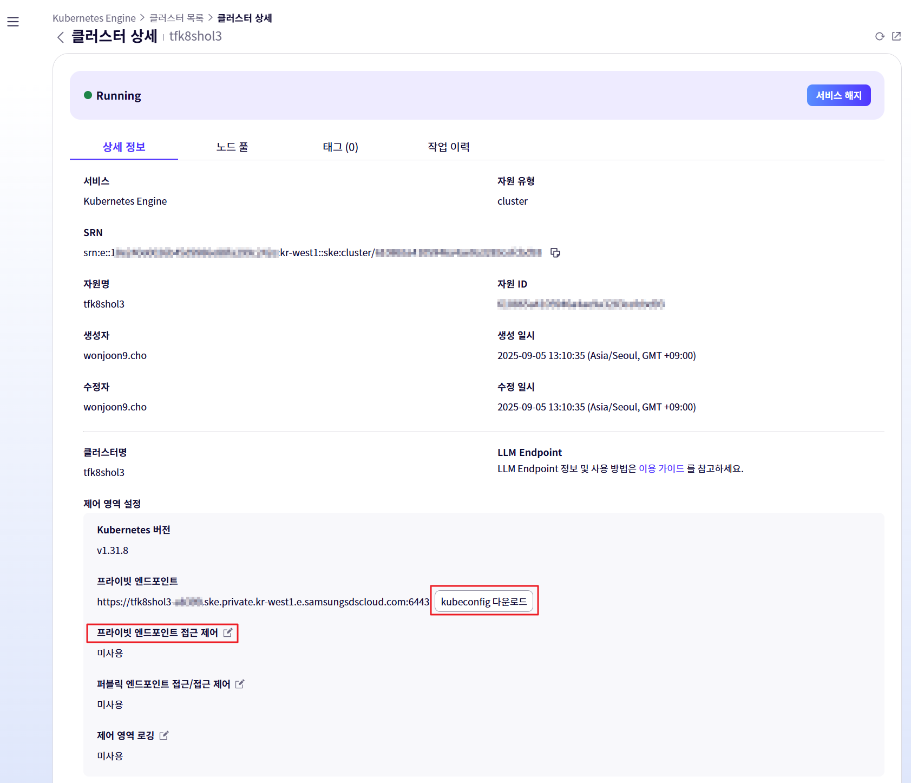

- **4. 프라이빗 엔드포인트 접근 제어 설정:**

  - Kubeconfig 다운로드 후, 동일한 클러스터 상세 페이지에서 [프라이빗 엔드포인트 접근 제어] 설정을 찾습니다.
  - [사용] 옵션에 체크합니다.

  - 접근을 허용할 소스로 virtual server리스트에서 web-ide를 선택하여 추가합니다. 이 설정을 통해 Web-IDE (Code-Server)가 클러스터의 API 서버에 접근할 수 있게 됩니다.

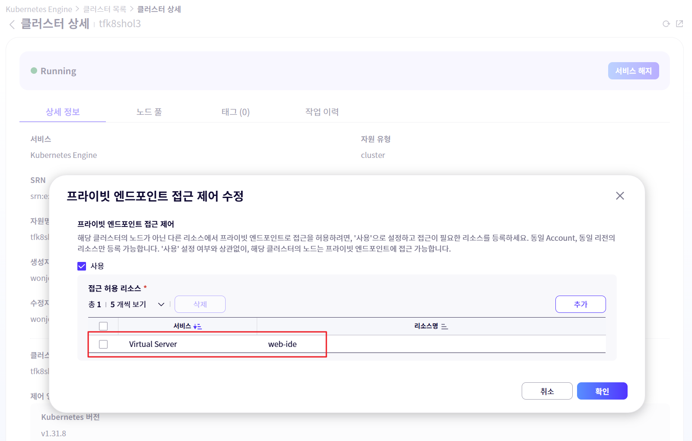


- **5. 설정 파일 복사 및 붙여넣기:**
    - 다운로드한 `kubeconfig` 파일을 텍스트 편집기로 열어 전체 내용을 복사합니다.
    - web-ide 터미널에서, `~/.kube/config` 파일을 생성하고 복사한 내용을 붙여넣습니다.
    - 아래 명령어를 사용하면 web-ide 편집기로 파일을 열 수 있습니다.

```bash
# 먼저 디렉토리가 없으면 생성합니다.
mkdir -p ~/.kube
# vi 편집기로 파일을 엽니다.
code-server ~/.kube/config
```

    - 에디터에서 복사한 kubeconfig 내용을 붙여넣고 저장합니다.

#### 클러스터 접속 테스트
`kubeconfig` 설정이 완료되면, 아래 명령어를 실행하여 클러스터와 정상적으로 통신이 되는지 확인합니다.

#### 버전 확인
```bash
# kubectl 클라이언트(CLI)와 쿠버네티스 서버(API 서버)의 버전을 확인합니다.
# Client Version과 Server Version이 모두 표시되어야 정상입니다.
kubectl version
```
결과
```
Client Version: v1.xx.x
Kustomize Version: v5.0.4-0.20230601165947-6ce0bf390ce3
Server Version: v1.xx.x-ske.p2
```

#### 클러스터 정보 확인
```bash
# 클러스터의 마스터 주소와 서비스 주소 등 기본 정보를 확인합니다.
kubectl cluster-info
```
결과
```
Kubernetes control plane is running at https://tfk8shol3-xxxxx.ske.kr-west.samsungsdscloud.com:6443
CoreDNS is running at https://tfk8shol3-xxxxx.ske.kr-west.samsungsdscloud.com:6443/api/v1/namespaces/kube-system/services/kube-dns:dns/proxy

To further debug and diagnose cluster problems, use 'kubectl cluster-info dump'.
```

#### 노드 정보 확인

```bash
# 클러스터에 포함된 워커 노드들의 목록과 상태(STATUS)를 확인합니다.
# 모든 노드의 상태가 'Ready'로 표시되어야 정상입니다.
kubectl get nodes
```
결과
```
NAME                             STATUS   ROLES    AGE     VERSION
ske-tfnodepoolhol3-2qz6c-kq7vh   Ready    <none>   3m21s   v1.30.6-ske.p3
```

### 7.4 정리하기
이번 장에서는 SCP의 Kubernetes Engine을 사용하여 컨테이너 애플리케이션을 위한 강력하고 확장 가능한 기반을 구축하는 방법을 학습했습니다. 

먼저, 복잡한 컨트롤 플레인 관리를 SCP에 위임하는 **관리형 Kubernetes 클러스터**를 생성했습니다. 이 과정에서 클러스터의 네트워크를 VPC와 연동하고, **프라이빗 엔드포인트**를 설정하여 허용된 Bastion Host에서만 안전하게 클러스터를 관리하도록 보안을 강화했습니다.

다음으로, 워크로드의 변화에 따라 자동으로 서버 수를 조절하는 **자동 확장/축소 기능이 활성화된 노드 풀**을 추가하여 탄력적인 운영 환경을 마련했습니다. 마지막으로, 사전에 생성한 **File Storage를 기본 볼륨으로 연동**하여, 컨테이너가 재시작되어도 데이터가 영구적으로 보존될 수 있는 기반을 갖추었습니다.

이를 통해 클라우드 네이티브 애플리케이션을 안정적으로 배포하고 운영하기 위한 모든 준비를 마쳤습니다.


## 8. Ingress Controller 배포

### 8.1 학습목표

- Ingress와 Ingress Controller의 개념과 필요성을 이해할 수 있다.
- Helm을 사용하여 Kubernetes 클러스터에 Nginx Ingress Controller를 배포할 수 있다.
- Ingress Controller가 SCP Load Balancer와 연동되는 과정을 이해하고, 할당된 공인 IP를 확인할 수 있다.
- DNS 설정 없이 `sslip.io` 서비스를 활용하여 임시 도메인을 사용하는 방법을 학습한다.

### 8.2 들어가기

### 8.2.1 서비스 구성도

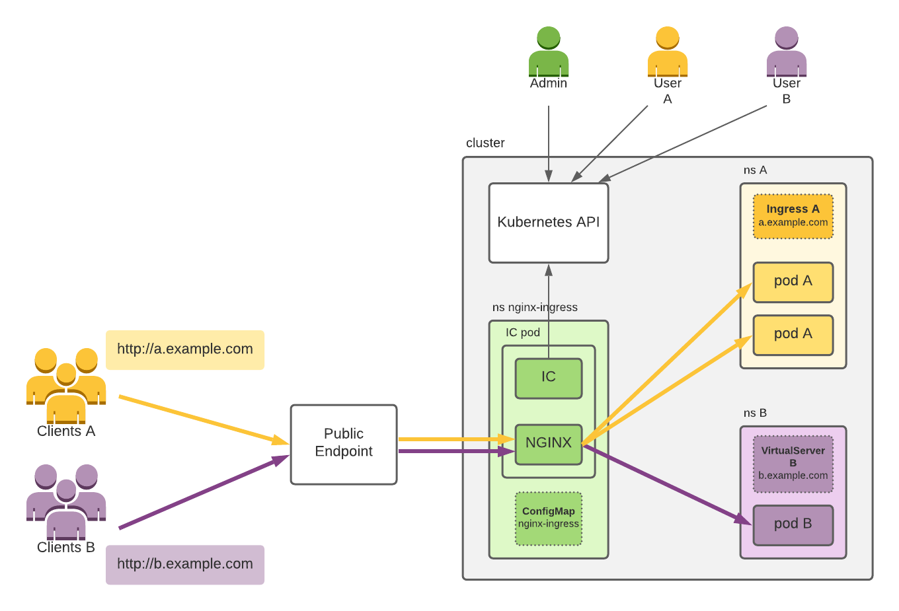

### 8.2.2 관련 용어

| No | 용어 | 설명 |
| --- | --- | --- |
| 1 | Ingress | 클러스터 외부의 요청을 내부 서비스로 연결하는 규칙을 정의하는 쿠버네티스 API 객체입니다. |
| 2 | Ingress Controller | Ingress 규칙을 실제로 구현하는 리버스 프록시 서버입니다. (예: Nginx, Traefik) |
| 3 | Helm | 쿠버네티스 애플리케이션을 쉽게 패키징하고 배포, 관리할 수 있는 패키지 매니저입니다. |
| 4 | Helm Chart | Helm으로 배포할 애플리케이션의 모든 리소스 정의, 설정값 등을 모아놓은 패키지입니다. |
| 5 | `sslip.io` | DNS 설정 없이 IP 주소를 기반으로 임시 도메인을 생성해주는 무료 와일드카드 DNS 서비스입니다. |

### 8.3 따라하기

### 8.3.1 작업 디렉토리 준비
**설명:** Ingress Controller 배포에 필요한 `values.yaml` 파일을 저장할 작업 디렉토리를 생성하고 이동합니다.

```bash
mkdir ingress
cd ingress
```

### 8.3.2 Helm 리포지토리 추가

**설명:** Helm으로 Nginx Ingress Controller를 설치하기 위해, 공식 차트가 저장된 리포지토리를 로컬 환경에 추가합니다.

```bash
helm repo add ingress-nginx https://kubernetes.github.io/ingress-nginx
helm repo update
```

결과
```


```

### 8.3.3 Subnet 및 Security Group ID 확인
설명: Ingress Controller와 연동할 Load Balancer가 생성될 Subnet과 적용할 Security Group의 ID를 SCP 콘솔에서 미리 확인해야 합니다.

- Subnet ID 확인 경로:
  - SCP 콘솔에 접속합니다.
  - **경로**: 서비스 → Networking → VPC
  - [Subnet] 탭을 클릭하여 Load Balancer용으로 생성한 Public Subnet인 `PublicSUB`를 선택하고, 해당 서브넷의 ID를 복사합니다.

- Security Group ID 확인 경로:
  - SCP 콘솔에 접속합니다.  
  - **경로**: 서비스 → Networking → Security Group
  - Kubernetes Engine용으로 생성한 `k8sSGxx` 보안 그룹을 선택합니다.
  - 상세 정보에서 ID를 복사합니다.

> ⚠️ 중요: 여기서 확인한 Subnet ID와 Security Group ID는 다음 단계에서 values.yaml 파일에 정확하게 입력해야 합니다.

### 8.3.4 Nginx Ingress Controller 설치를 위한 values.yaml 파일 작성
- 설명: Helm 차트의 기본값을 변경하여 SCP 환경에 최적화된 Load Balancer를 생성하기 위해 values.yaml 파일을 작성합니다. 이 파일에 SCP 관련 어노테이션을 추가하여 공인 IP 할당, 특정 서브넷 및 보안 그룹 지정을 설정합니다.

#### 1. values.yaml 파일 생성
`ingress` 디렉토리 안에서 `values.yaml` 파일을 생성합니다.

```bash
code-server values.yaml
```

#### 2. values.yaml 어노테이션 설명
| 어노테이션 키 | 설명 |
| :--- | :--- |
| `service.beta.kubernetes.io/scp-load-balancer-public-ip-enabled` | 생성되는 Load Balancer에 공인 IP(`PUBLIC NAT IP`)를 할당하도록 설정합니다. (`true`) |
| `service.beta.kubernetes.io/scp-load-balancer-subnet-id` | Load Balancer가 생성될 서브넷의 고유 ID를 지정합니다. |
| `service.beta.kubernetes.io/scp-load-balancer-security-group-id` | Kubernetes Engine에 적용할 보안 그룹의 고유 ID를 지정합니다. |
| `service.beta.kubernetes.io/scp-load-balancer-source-ranges-firewall-rules` | 서비스의 `loadBalancerSourceRanges` 필드에 지정된 IP 대역에 대한 방화벽 규칙을 자동으로 생성합니다. |
| `service.beta.kubernetes.io/scp-load-balancer-snat-healthcheck-firewall-rules` | 방화벽 규칙( LB Source NAT IP, HealthCheck IP → 멤버 IP:Port )을 자동으로 추가합니다.  |

#### 3. values.yaml 소스 코드
아래 내용을 `values.yaml` 파일로 생성하고, 위에서 확인한 `Subnet ID`와 `Security Group ID`를 올바르게 입력합니다.
```yaml
controller:
  service:
    annotations:
      service.beta.kubernetes.io/scp-load-balancer-public-ip-enabled: "true"
      service.beta.kubernetes.io/scp-load-balancer-subnet-id: "<여기에_Subnet_ID를_입력하세요>"  # <--- ⚠️ 실제 LB의 Subnet ID로 변경하세요.
      service.beta.kubernetes.io/scp-load-balancer-security-group-id: "<여기에_Security_Group_ID를_입력하세요>"  # <--- ⚠️ 실제 K8S의 Security Group ID로 변경하세요.
      # service.beta.kubernetes.io/scp-load-balancer-source-ranges-firewall-rules: "true"
      # service.beta.kubernetes.io/scp-load-balancer-snat-healthcheck-firewall-rules: "true"
```

### 8.3.4 Nginx Ingress Controller 설치

**설명:** `helm install` 명령어를 사용하여 `ingress-nginx` 네임스페이스에 컨트롤러를 배포합니다. 이 과정에서 SCP의 Load Balancer가 자동으로 생성되고 Ingress Controller Service와 연동됩니다.

```bash
helm install nginx-ingress ingress-nginx/ingress-nginx \
  -f values.yaml \
  --namespace ingress-nginx \
  --create-namespace
```

결과
```bash
NAME: ingress-nginx
LAST DEPLOYED: Mon Aug 25 00:46:59 2025
NAMESPACE: ingress-nginx
STATUS: deployed
REVISION: 1
TEST SUITE: None
NOTES:
The ingress-nginx controller has been installed.
It may take a few minutes for the load balancer IP to be available.
You can watch the status by running 'kubectl get service --namespace ingress-nginx ingress-nginx-ingress-nginx-controller --output wide --watch'
(...이하 생략...)
```


### 8.3.5 Nginx Ingress Controller 배포 확인

**설명:** `ingress-nginx` 네임스페이스의 관련 리소스들이 정상적으로 생성되고 `Running` 상태인지 확인합니다. 특히 `ingress-nginx-ingress-nginx-controller` 서비스의 `TYPE`이 `LoadBalancer`로 되어 있는지 확인해야 합니다.

```bash
kubectl get all -n ingress-nginx
```
결과
```bash
NAME                                                             READY   STATUS    RESTARTS   AGE
pod/ingress-nginx-ingress-nginx-controller-765f78bb6d-l5h9q   1/1     Running   0          76s

NAME                                                          TYPE           CLUSTER-IP       EXTERNAL-IP      PORT(S)                      AGE
service/ingress-nginx-ingress-nginx-controller             LoadBalancer   172.20.65.50     192.168.50.169   80:30311/TCP,443:31056/TCP   76s
service/ingress-nginx-ingress-nginx-controller-admission   ClusterIP      172.20.106.213   <none>           443/TCP                      76s

NAME                                                        READY   UP-TO-DATE   AVAILABLE   AGE
deployment.apps/ingress-nginx-ingress-nginx-controller   1/1     1            1           76s

NAME                                                                   DESIRED   CURRENT   READY   AGE
replicaset.apps/ingress-nginx-ingress-nginx-controller-765f78bb6d   1         1         1       76s

```

### 8.3.6 Load Balancer 연동 확인 및 PUBLIC NAT IP 확인

**설명:** SCP v2 환경에서는 쿠버네티스에서 `Type: LoadBalancer`로 서비스를 배포하면, SCP가 이를 감지하여 자동으로 **Load Balancer 리소스와 리스너를 생성**하고 서비스에 연결합니다. 이 과정을 통해 외부 트래픽이 클러스터 내부의 서비스로 전달될 수 있습니다. 이제 Ingress Controller 서비스에 의해 생성된 Load Balancer와 접속에 필요한 공인 IP(`PUBLIC NAT IP`)를 확인합니다.

#### 1. 서비스 경로
- 서비스 → **Networking** → **Load Balancer**

#### 2. **확인 절차:**

1. **Load Balancer 목록 확인:** Load Balancer 메뉴로 이동하면 `ingress-nginx-ingress-nginx-controller` 서비스에 의해 자동으로 생성된 Load Balancer 항목을 찾을 수 있습니다. 이 Load Balancer는 쿠버네티스 서비스에 의해 동적으로 생성된 것입니다.

2. **리스너 확인:** 생성된 Load Balancer를 클릭하여 상세 정보로 이동한 후, **[연결된 자원]** 탭을 선택합니다. Ingress Controller가 사용하는 포트(일반적으로 80, 443)에 대한 리스너가 자동으로 생성되어 있는지 확인합니다.

3. **공인 IP(PUBLIC NAT IP) 확인:** Load Balancer 목록 또는 상세 정보에서 **`PUBLIC NAT IP`** 주소를 확인하고 반드시 메모해 둡니다. 이 IP 주소는 앞으로 Jenkins, ArgoCD, 그리고 최종 애플리케이션에 접근하기 위한 공용 주소로 계속 사용됩니다.

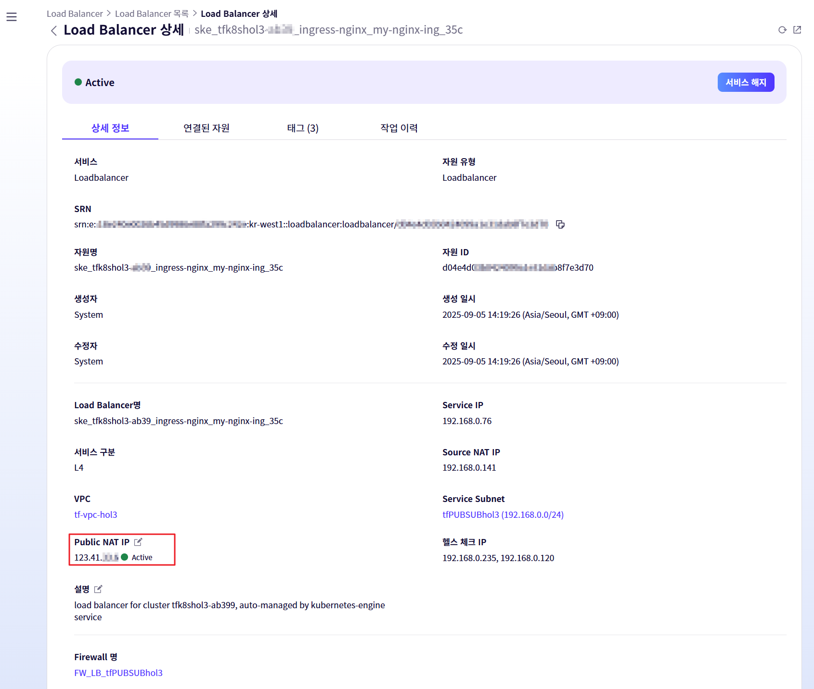

> 💡 **sslip.io와 함께 사용:** 이 공인 IP 주소는 `sslip.io`와 같은 와일드카드 DNS 서비스와 결합하여 `jenkins.123.45.67.89.sslip.io` 와 같은 도메인을 즉시 만들어 사용하는 데 활용됩니다.

> ⚠️ **중요:** 이 `PUBLIC NAT IP` 주소는 실습 전반에 걸쳐 사용되므로, 정확히 확인하고 메모해두는 것이 매우 중요합니다.

### 8.3.7 로드밸런서용 자동 생성 Firewall 미사용 처리

LoadBalancer 타입의 서비스를 생성하면 해당 LoadBalancer용 Firewall(`FW_LB_tfPUBSUBhol3`)이 자동으로 생성됩니다. Internet Gateway에 이미 Firewall이 설정되어 있으므로, Load Balancer에 Firewall을 이중으로 설정하면 보안은 강화되지만 설정 복잡도가 높아집니다.

따라서 본 실습에서는 Terraform으로 생성한 Security Group으로만 접근을 제어하기 위해 Load Balancer용 Firewall은 미사용으로 설정합니다.

- **경로:** 서비스 → Networking → Firewall 목록
- **설정:** 목록에서 `FW_LB_tfPUBSUBhol3` Firewall을 찾아 **[미사용]**으로 설정합니다.

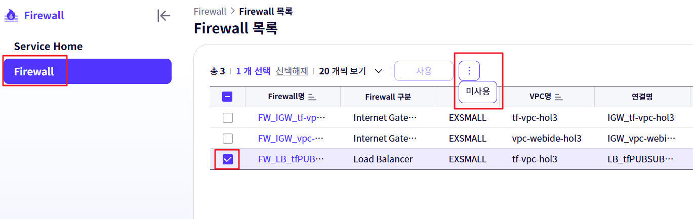

### 8.3.8 로드밸런서 헬스체크 확인

`3.3.7` 단계에서 Load Balancer용 Firewall을 미사용으로 처리한 후, 로드밸런서의 헬스체크 상태가 Unhealthy에서 Healthy로 정상 변경되는지 확인합니다.

#### 1. 서비스 경로
- 서비스 → Networking → Load Balancer → LB 서버 그룹
#### 2. 확인 절차
1. LB 서버 그룹 목록에서 Ingress Controller에 의해 생성된 서버 그룹을 선택합니다.
2. **[연결된 자원]** 탭을 클릭합니다.
3. 등록된 Worker Node들의 **헬스 체크 상태**가 **Healthy**로 표시되는 것을 최종적으로 확인합니다. 처음에는 Unhealthy 상태였다가, Firewall 정책이 적용된 후 Healthy로 변경됩니다.

이 과정을 통해 Ingress Controller와 Load Balancer가 정상적으로 연동되었음을 검증할 수 있습니다.

### 8.3.9 Ingress Controller 동작 확인 (curl)

이제 Load Balancer의 Public IP로 직접 HTTP 요청을 보내 Ingress Controller가 정상적으로 응답하는지 확인합니다. 아직 아무런 Ingress 규칙을 설정하지 않았기 때문에 `404 Not Found` 응답이 오는 것이 정상입니다. 중요한 것은 응답을 `nginx`가 보내는지 확인하는 것입니다.

1.  web-ide 터미널을 엽니다.
2.  `3.3.6` 단계에서 확인한 Load Balancer의 **PUBLIC NAT IP**를 사용하여 아래 `curl` 명령어를 실행합니다.

```bash
curl -I http://<LB-PUBLIC-NAT-IP>.sslip.io
```

**정상 응답 예시:**

아래와 같이 `Server` 헤더에 `nginx`가 표시되고 `404` 상태 코드가 반환되면 Ingress Controller가 외부 요청을 정상적으로 수신하고 있는 것입니다.

```
<html>
<head><title>404 Not Found</title></head>
<body>
<center><h1>404 Not Found</h1></center>
<hr><center>nginx</center>
</body>
</html>
```

만약 응답이 없거나(Timeout) 다른 오류가 발생하면, Load Balancer, Security Group, Firewall 설정을 다시 한번 확인해야 합니다.


## 8.4 정리하기

- **Ingress Controller 배포:** Helm을 사용하여 Nginx Ingress Controller를 성공적으로 배포하고, SCP Load Balancer와 연동하여 외부 트래픽을 수신할 단일 진입점을 마련했습니다.
- **동적 라우팅 기반 마련:** 배포된 Ingress Controller를 통해 향후 다양한 애플리케이션을 호스트 이름 기반으로 라우팅할 수 있는 기반을 구축했습니다.
- **임시 도메인 활용:** `sslip.io`를 이용하여 복잡한 DNS 설정 없이도 Load Balancer의 공인 IP에 대한 도메인을 즉시 사용할 수 있음을 확인했습니다.


# 9. Helm을 활용한 애플리케이션 배포

## 9.1 학습목표

- Helm의 개념과 역할을 이해하고, 쿠버네티스 애플리케이션을 패키징하는 방법을 학습한다.
- `helm create` 명령어를 사용하여 애플리케이션 배포를 위한 Helm 차트의 기본 구조를 생성할 수 있다.
- 배포 환경에 맞게 `values.yaml` 파일을 수정하여 이미지, Ingress, Secret 등의 설정을 변경할 수 있다.
- `helm install` 및 `helm uninstall` 명령어를 사용하여 클러스터에 애플리케이션을 수동으로 배포하고 삭제하는 과정을 실습한다.

## 9.2 들어가기

### 9.2.1 서비스 개념도

Kubernetes에 애플리케이션을 배포하려면 Deployment, Service, Ingress 등 여러 리소스 YAML 파일을 개별적으로 관리해야 합니다. 애플리케이션이 복잡해질수록 이 파일들의 수는 늘어나고, 환경별로 설정을 다르게 적용하는 작업은 번거롭고 실수를 유발하기 쉽습니다. Helm은 이러한 문제를 해결하기 위한 쿠버네티스의 패키지 관리자입니다. 관련 리소스들을 '차트(Chart)'라는 일관된 패키지 단위로 묶어주고, 간단한 명령어로 애플리케이션의 설치, 업그레이드, 삭제를 관리할 수 있게 해줍니다. 이번 장에서는 Helm을 사용하여 애플리케이션을 차트로 패키징하고 클러스터에 배포하는 기본 과정을 학습합니다.


### 9.2.2 관련 용어

| No | 용어 | 설명 |
| --- | --- | --- |
| 1 | Helm | 쿠버네티스 애플리케이션을 위한 패키지 관리 도구입니다. 복잡한 애플리케이션을 '차트' 단위로 쉽게 설치하고 관리할 수 있게 해줍니다. |
| 2 | Helm Chart | 애플리케이션을 구성하는 모든 쿠버네티스 리소스 정의(템플릿), 설정값(`values.yaml`), 차트 정보(`Chart.yaml`)가 담긴 패키지입니다. |
| 3 | GitOps Repository | 애플리케이션의 배포 상태(Desired State)를 정의하는 Helm 차트나 매니페스트 파일들을 저장하고 관리하는 전용 Git 저장소입니다. |
| 4 | `helm install` | Helm 차트를 사용하여 쿠버네티스 클러스터에 애플리케이션의 새로운 인스턴스(릴리스)를 배포하는 명령어입니다. |

## 9.3 따라하기


### 9.3.2 애플리케이션 배포용 Helm 차트 생성 및 Push

`helm create` 명령어로 샘플 애플리케이션을 배포하기 위한 기본 차트 구조를 생성합니다.
    
```bash
cd ~/project
helm create my-app-chart

```
    

### 9.3.4 Helm을 이용한 수동 배포 및 확인

ArgoCD를 사용하기 전에, Helm 명령어로 직접 애플리케이션을 배포하여 차트가 정상적으로 동작하는지 검증합니다. `values.yaml` 파일을 수정하여 이미지 정보와 Ingress 설정을 우리 환경에 맞게 변경합니다.
    
#### 1. `values.yaml` 파일 수정
- `web-ide`의 파일 탐색기에서 `my-app-chart/values.yaml` 파일을 엽니다.
- 아래 내용과 같이 `image.repository`, `image.tag`를 수정하고, `ingress` 설정을 추가합니다.

> ⚠️ 중요:
> 
> - `repository`를 본인의 **Private Endpoint 주소**로 변경하세요.
> - `host`의 `<LB-PUBLIC-NAT-IP>` 부분을 **Load Balancer의 NAT IP 주소**로 변경하세요.
        
```yaml
# values.yaml

image:
  repository: <SCP-Registry-URL>/web-app/my-app  # 수정
  pullPolicy: IfNotPresent
  # Overrides the image tag whose default is the chart appVersion.
  tag: "latest" # 또는 Jenkins에서 빌드한 태그로 수정
  
imagePullSecrets:
  - name: registry-credentials # Secret의 이름 수정

... # 중간 내용 생략

ingress:
  enabled: true     # true로 수정
  className: "nginx"    # nginx로 수정
  annotations:
    cert-manager.io/cluster-issuer: "letsencrypt-prod"  # anotations 추가
    # kubernetes.io/ingress.class: nginx
    # kubernetes.io/tls-acme: "true"
  hosts:
    - host: web-app.<LB-PUBLIC-NAT-IP>.sslip.io   # host 이름 수정
      paths:
        - path: /
          pathType: ImplementationSpecific
  tls:  # TLS 설정 수정
  - secretName: web-app-tls-secret
    hosts:
      - web-app.<LB-PUBLIC-NAT-IP>.sslip.io
  #  - secretName: chart-example-tls
  #    hosts:
  #      - chart-example.local

```
        
#### 2. Helm으로 수동 배포
        
```bash
# my-app-chart 디렉토리에서 실행
helm install my-web-app . -n cicd

```
        
#### 3. 배포 확인
Pod가 정상적으로 실행되는지 확인합니다.
            
```bash
kubectl get pods -n cicd
```
            
웹 브라우저에서 `values.yaml`에 설정한 `host` 주소(`http://web-app.<LB-PUBLIC-NAT-IP>.sslip.io`)로 접속하여 "Hello, CI/CD World on SCP!" 메시지가 표시되는지 확인합니다.

#### 4. 저장소에 push

수정한 `values.yaml`을 GitOps 저장소에 Push 합니다. 
        
```
cd my-app-chart
git add values.yaml
git commit -m "Update image, secret, and ingress settings"
git push origin main

```

#### 5. **수동 배포된 릴리스 삭제**
ArgoCD가 관리할 수 있도록, 테스트용으로 수동 배포했던 릴리스를 삭제합니다.
            
```bash
helm uninstall my-web-app -n cicd
```

## 9.4 정리하기

- **Helm 차트 생성 및 관리:** `helm create`로 표준화된 차트 구조를 생성하고, `values.yaml`을 수정하여 배포 환경에 맞는 설정을 주입하는 방법을 학습했습니다.
- **GitOps 저장소 구성:** 애플리케이션 배포 상태를 정의하는 Helm 차트를 버전 관리하기 위한 별도의 GitOps 저장소를 생성하고 연동했습니다.
- **수동 배포 검증:** `helm install` 명령어를 통해 클러스터에 애플리케이션을 직접 배포하고 접속하여, Helm 차트가 의도대로 동작하는지 검증하는 과정을 완료했습니다.
- **ArgoCD 도입 준비:** 수동 배포 및 검증을 통해 GitOps 자동화 도구인 ArgoCD를 도입하기 위한 모든 준비를 마쳤습니다.


## 10. 실습 자원 삭제하기

### 10.1 학습목표
- 실습을 통해 생성한 모든 클라우드 리소스를 올바른 순서로 삭제하는 방법을 학습합니다.
- 리소스 간의 종속성을 이해하고, 순서에 맞는 삭제를 통해 오류 없이 자원을 정리할 수 있습니다.
- 불필요한 과금을 방지하기 위한 클라우드 환경 정리의 중요성을 이해합니다.

### 10.2 들어가기
클라우드 실습을 마친 후에는 사용한 리소스를 정리하는 것이 매우 중요합니다. 리소스를 삭제하지 않으면 계속해서 비용이 발생할 수 있습니다. 클라우드 리소스들은 서로 종속성을 가지고 있기 때문에, 생성의 역순으로 삭제를 진행해야 합니다. 예를 들어, VPC를 삭제하기 전에 VPC 내부에 있는 모든 서브넷, 서버 등의 리소스가 먼저 삭제되어야 합니다.

이번 장에서는 실습에서 생성한 모든 자원을 오류 없이 안전하게 삭제하는 전체 과정을 단계별로 안내합니다.

### 10.3 따라하기

**중요:** 아래에 명시된 순서를 반드시 지켜서 삭제를 진행해야 합니다.

#### 1. Helm 배포 애플리케이션 삭제
- **위치:** Web-IDE 터미널
- **방법:** `helm uninstall my-web-app -n cicd` 명령어를 실행하여 배포된 애플리케이션을 삭제합니다.

#### 2. Ingress Controller 삭제
- **위치:** Web-IDE 터미널
- **방법:** `helm uninstall nginx-ingress -n ingress-nginx` 명령어를 실행하여 Ingress Controller를 삭제합니다. 이 과정에서 생성된 Load Balancer도 함께 삭제됩니다.

#### 3. 노드풀 삭제
- **경로:** 서비스 → Container → Kubernetes Engine → 클러스터
- **방법:** `k8scls` 클러스터를 선택하고, [노드 풀] 탭에서 생성한 노드 풀(`nodepool`)을 삭제합니다.

#### 4. 클러스터 삭제
- **경로:** 서비스 → Container → Kubernetes Engine → 클러스터
- **방법:** `k8scls` 클러스터를 선택하고 삭제합니다.

#### 5. WEB-IDE Virtual Server 삭제
- **경로:** 서비스 → Compute → Virtual Server → Virtual Server
- **방법:** `web-ide` 서버를 선택하고 삭제합니다.

#### 6. Key Pair 삭제
- **경로:** 서비스 → Compute → Virtual Server → Key Pair
- **방법:** 실습에서 생성한 Key Pair(`mykey-hol2`)를 선택하고 삭제합니다.

#### 7. DB Service 삭제
- **경로:** 서비스 → Database → MariaDB(DBaaS)
- **방법:** 생성한 `mdbcls` 클러스터를 선택하고 삭제합니다.

#### 8. Security Group 삭제
- **경로:** 서비스 → Networking → Security Group → Security Group
- **방법:** 생성했던 모든 Security Group(`BastionSG`, `WebServerSG`)을 선택하고 삭제합니다. 리소스에 연결되어 있으면 삭제되지 않으므로, 연결된 리소스가 모두 삭제되었는지 먼저 확인해야 합니다.

#### 9. Firewall 규칙 삭제
- **경로:** 서비스 → Networking → Firewall → Firewall
- **방법:** `FW_IGW_vpc-hol2` 방화벽에 추가했던 모든 규칙을 삭제합니다.

#### 10. NAT Gateway 삭제
- **경로:** 서비스 → Networking → VPC → NAT Gateway
- **방법:** 생성한 NAT Gateway를 선택하고 삭제합니다.

#### 11. Internet Gateway 삭제
- **경로:** 서비스 → Networking → VPC → Internet Gateway
- **방법:** `vpc-hol2`에 연결된 Internet Gateway를 선택하고 연결을 해제한 후 삭제합니다.

#### 12. 서브넷 삭제
- **경로:** 서비스 → Networking → VPC → Subnet
- **방법:** 생성했던 모든 서브넷(`PublicSUB`, `PrivateK8S`, `PrivateDB`)을 선택하고 삭제합니다.

#### 13. VPC 삭제
- **경로:** 서비스 → Networking → VPC → VPC
- **방법:** `vpc-hol2` VPC를 선택하고 삭제합니다.


### 10.4 정리하기
이번 장에서는 실습을 통해 생성했던 모든 클라우드 리소스를 삭제하는 방법을 배웠습니다. 리소스 간의 종속 관계를 이해하고, 생성의 역순으로 자원을 정리하는 것이 중요하다는 점을 학습했습니다. 올바른 자원 정리는 불필요한 비용 발생을 막고 클라우드 환경을 깨끗하게 유지하는 데 필수적인 과정입니다. 이로써 Hands-on Lab의 모든 과정을 성공적으로 마쳤습니다.